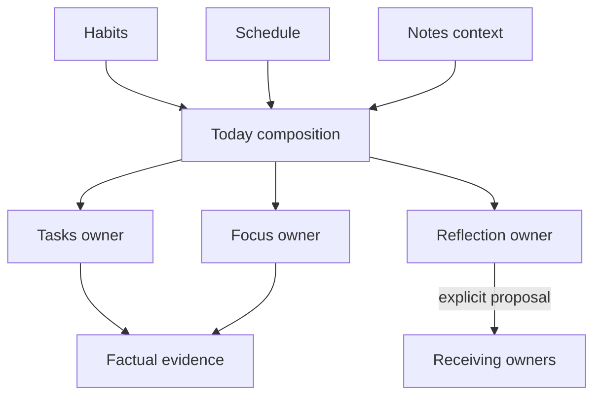

# Requirements

### Overview & Goal
Execute Phase 3 — Implement and Harden the Core Loop — from the current worktree baseline through Gate 3. The outcome is not a release; it is a repeatable, evidence-backed journey: Direction → Commitment → Action → Evidence → Sensemaking → Adaptation.

### Current Authority
- Follow `docs/current-phase/current-sprint.md` as the execution register, `docs/current-phase/phase-3/gate-checklist.md` as the gate evidence register, and the linked package delivery/validation documents.
- Gate 2 is passed, P1 Today is in progress, and D-010 records P2–P6 as authorized in the fixed order: P2 Tasks → P3 Focus → P4 Evidence → P5 Reflection → P6 Supporting → P7 Gate 3 evidence.
- Resolve the stale package-status wording in `current-sprint.md` against accepted D-010 / the Gate 3 checklist before execution tracking; do not create a new product decision because package authorization already exists.

### In Scope
- Finish Today orientation, source-aware state, route recovery, canonical owner handoffs, and no-write behavior.
- Implement Tasks commitment/action lifecycle, Focus session recovery, factual evidence, Reflection/adaptation, and bounded Habits/Schedule/Notes support.
- Validate normal, empty, partial/stale, unavailable, failed, interrupted, correction/withdrawal, permission, safe-departure, accessibility, identity, date/time, and recovery paths.
- Produce reproducible evidence for every `TODAY-*`, `TASK-*`, `FOCUS-*`, `RECORD-*`, `REFLECT-*`, `SUPPORT-*`, and journey acceptance ID.

### Out of Scope / Stop Conditions
- No new domains or routes, Goals/AI Coach/standalone Knowledge/Growth/Weekly Review, autonomous prioritization, universal scoring, inferred attribution/outcomes, or implicit adaptation.
- Do not apply or claim pending migrations until the separately defined D-012 protocol is executed and verified.
- Do not merge to `main`, deploy, or claim release readiness from Gate 3 implementation alone; those require Gate 4 and separate Founder authorization.

### Definition of Done
- P1–P6 match their approved delivery designs and preserve owner boundaries: Today composes, Tasks owns commitments, Focus owns sessions, Reflection owns interpretation, and receiving owners apply adaptations.
- Last-confirmed data survives refresh/error; pending, failed, local-draft, stale, disconnected, and unavailable states remain visible and truthful.
- User scope/RLS, shared Zod/RHF validation, `Asia/Singapore` date keys, instant timestamps, local drafts, safe errors, accessibility, and pending-migration truth are evidenced.
- The Founder can repeat the complete seeded and real-data journey and records exactly `PASS`, `HOLD`, or `REWORK` in the Gate 3 checklist.

# Technical Design

### Current Implementation
- The app is a Next.js App Router / React / TypeScript frontend with Supabase data access; authenticated pages live under `src/app/(main)/`, feature UI under `src/components/`, domain logic under `src/lib/`, types under `src/types/`, and SQL under `supabase/`.
- Today already has a composition boundary in `src/lib/today-composition.ts` with source envelopes and independent settlement; `src/lib/today-composition.test.ts` verifies empty/error/stale/source-scoped retry, explicit Singapore date forwarding, and unavailable Focus attribution.
- Tasks already centralizes user-scoped reads and writes in `src/lib/tasks.ts`, including `requireUserId`, shared validation, task normalization, completion, manual ordering, and Next Up invalidation. The Tasks route delegates to `src/components/tasks/tasks-page-content.tsx`.
- Existing Focus UI is split across `src/components/focus/` (including current session, timer, history, quick session, and Next Up components); `src/app/(main)/focus/page.tsx` is the established route. `src/app/(main)/workplace/page.tsx` currently redirects to `/`, so Phase 3 must integrate action mode without silently inventing a new route.
- Reflection is owned by `src/components/reflection/reflection-page-content.tsx` through `src/app/(main)/reflection/page.tsx`; Habits, Schedule, and Notes already have feature component areas and routes to extend only within the approved supporting-surface boundary.

### Key Decisions
- Preserve the existing owner architecture rather than creating a central workflow service: cross-surface composition may read and label facts, but mutations remain in canonical owner modules.
- Model each source with explicit semantic state (`loading`, `ready`, `empty`, `partial`, `stale`, `unavailable`, `disconnected`, or `error`) and freshness/limitation metadata; never upgrade a projection into an outcome.
- Use persisted timestamps as authority for Focus elapsed meaning; the client timer is display/recovery assistance only.
- Keep Next Up and Focus attribution unavailable while `tasks_next_up_queue.sql` and `focus_session_task_totals.sql` remain unapplied/unverified; no local or source inspection can be treated as live capability.
- Treat local drafts as recoverable continuity, never as saved records; failed downstream Reflection save must not undo confirmed Focus or Task facts.

### Proposed Changes by Package
- **P1 Today:** complete read-only composition in `src/lib/today-composition.ts` and Today components; add route/re-entry/source retry behavior and owner links without durable Today writes.
- **P2 Tasks:** extend `src/lib/tasks.ts`, task types/validation, and `src/components/tasks/` for create/clarify/select/start/complete/revise/defer/restore/withdraw/correct/recover; selection must have unchanged-state assertions and Next Up must be capability-gated.
- **P3 Focus:** extend the existing Focus service/components and session types with confirmed start/pause/resume/conclude/leave states, persisted instants, safe re-entry, interruption recovery, attribution fallback, and Reflection handoff.
- **P4 Evidence:** add source-labelled evidence adapters/envelopes in `src/lib/` and integrate them into approved consuming surfaces while retaining record identity, provenance, scope, freshness, derivation, and correction routing.
- **P5 Reflection:** extend the existing Reflection owner path for daily/custom/session-end identity, validation, draft/save/retry/correct/withdraw/skip/re-entry, linked facts, and explicit proposal → receiving-owner apply/decline/defer handoff.
- **P6 Supporting:** keep `src/components/habits/`, `src/components/schedule/`, and `src/components/notes/` bounded, optional, independently recoverable, accessible, and non-blocking; planning remains owned by Tasks/Habits.

### Architecture Diagram

### File and Documentation Updates
- Implement against the existing feature components, `src/lib/` domain modules, `src/types/`, and tests rather than introducing parallel abstractions.
- Keep approved package delivery designs and validation plans authoritative: `docs/04-features/delivery/*.md` and `docs/04-features/validation/*.md`.
- Update `docs/current-phase/current-sprint.md`, `docs/current-phase/phase-3/gate-checklist.md`, the P1 evidence record, package evidence records, and the active developer log as milestones complete.
- Use worktree-local `.env.local` per D-013; confirm it remains ignored and never commit it.

# Testing

### Validation Approach
Execute the package validation plans as evidence collection, not as a single happy-path test run. Every result records package/acceptance ID, fixture or account, Singapore date key, environment, method, result, limitation, and owner, with sensitive data redacted.

### Per-Package Scenarios
- **Today / `TODAY-*`:** seeded and real `/` walkthrough; direct entry, re-entry, handoff, source-scoped retry, late failure, empty/partial/stale/unavailable state, accessibility, and proof that Today performs no durable write.
- **Tasks / `TASK-*`:** create/revise/clarify/select/start/complete/restore/defer/withdraw/correct; selection before/after unchanged-state assertions; retained history; pending/failed/local-draft recovery; safe errors; Next Up unavailable until migration verification.
- **Focus / `FOCUS-*`:** start/pause/resume/conclude/leave; persisted elapsed-time checks; reload/interruption/re-entry; failed action preserving last confirmed session; attribution-unavailable fallback; Reflection handoff without mutating Focus facts.
- **Evidence / `RECORD-*` and `JOURNEY-*`:** show source, identity, provenance, scope, freshness, and derivation; prove selection, duration, Reflection text, and source absence do not become outcome claims; route correction/withdrawal to canonical owners.
- **Reflection / `REFLECT-*`:** validate, save, retry, correct, withdraw, skip, re-enter, restore local draft, and explicitly apply/decline/defer a proposal in the receiving owner; prove Reflection does not rewrite Task/Focus facts.
- **Supporting / `SUPPORT-*`:** empty, unavailable, stale, disconnected, error, retry, re-entry, owner handoff, keyboard/screen-reader, and non-blocking core-loop behavior for Habits, Schedule, and Notes.

### Cross-Cutting Checks
- Run `npm test`, `npm run lint`, configured `npm run build`, and `git diff --check` at each package checkpoint and before Gate 3.
- Execute the six-point security checklist in `.ai/checklists/security.md`: user scope/RLS, runtime validation, secrets, RLS on new tables, protected routes, and safe errors.
- Verify two-account isolation, Singapore midnight boundary, instant timestamp behavior, pending migration truth, responsive/touch/reduced-motion behavior, visible focus, non-color state meaning, and safe departure.
- Review all remaining lint/audit/middleware/build limitations against D-011; record limitations rather than converting them into passes.

### Gate 3 Evidence Threshold
Gate 3 remains open until G3-01 through G3-08 have linked evidence or explicit Founder disposition. A material cross-account exposure, unauthorized write, inferred outcome/attribution, hidden pending state, lost confirmed history, unsafe error, or inaccessible recovery path forces `HOLD` or `REWORK`.

# Delivery Steps

###   Step 1: Establish Phase 3 baseline and finish P1 Today
The Phase 3 worktree is reproducible, P1 Today is complete within scope, and its Gate 3 evidence is recorded.

- Work only in the Phase 3 worktree/branch; do not merge or deploy.
- Verify the accepted D-008, D-009, D-010, D-011, D-012, and D-013 decisions and reconcile stale package-status text in `docs/current-phase/current-sprint.md`.
- Copy the approved local environment into the worktree per D-013, confirm `.env.local` is ignored, and verify `npm run dev` and `npm run build` can use it.
- Finish P1 in `src/lib/today-composition.ts` and the Today components: read-only composition, independent source settlement, Singapore date forwarding, request identity, source-scoped retry, re-entry, owner handoffs, and no score/inferred meaning.
- Run the Today validation plan and update `docs/current-phase/phase-3/today-orientation-implementation-evidence.md`, the sprint status, and the active log.
- Run `npm test`, `npm run lint`, configured `npm run build`, `git diff --check`, and the security checklist before the Founder P1/build checkpoint.

###   Step 2: Implement and validate P2 Tasks
Tasks own the complete commitment/action lifecycle with truthful recovery and unchanged-state behavior.

- Implement against `docs/04-features/delivery/tasks-core-loop.md` and its validation plan, extending `src/lib/tasks.ts`, task types/validation, and `src/components/tasks/`.
- Cover create, clarify, select, start, complete, revise, defer, restore, withdraw, correct, retained history, pending/failed/local-draft states, and safe re-entry.
- Prove Task-to-Focus selection does not change completion or history; keep Next Up unavailable while its migration is pending/unverified.
- Verify user-scoped reads/writes, shared Zod/RHF validation, safe errors, accessibility, recovery, two-account isolation, and Singapore date behavior.
- Record all `TASK-*` evidence and the P2 Founder checkpoint; only proceed when implementation and validation limitations are explicitly accepted or reworked.

###   Step 3: Implement P3 Focus action mode
Focus provides a confirmed, interruptible, recoverable session lifecycle without inventing duration, attribution, or outcomes.

- Implement the approved Focus delivery design in the existing Focus domain logic, `src/components/focus/`, and session types; preserve the current `/focus` boundary and do not create an unauthorized route.
- Add confirmed start/pause/resume/conclude/leave transitions, persisted instant timestamps, failure handling, local recovery, and explicit resume/reconcile/retry/leave re-entry choices.
- Keep the timer non-authoritative, preserve last-confirmed sessions, disclose attribution fallback while migration capability is unverified, and hand off to Reflection without coupling saves.
- Execute all `FOCUS-*` validation scenarios plus accessibility, two-account, timezone, seeded/real-data, and interruption evidence.
- Run package quality/security checks, update the evidence register, and obtain the P3 checkpoint before P4.

###   Step 4: Implement P4 factual evidence
Approved consuming surfaces display source-labelled facts with provenance and limitations while canonical owners retain all corrections.

- Implement the factual evidence delivery design and adapters/envelopes in `src/lib/` using the existing Task, Focus, Today, and Reflection boundaries.
- Preserve source, record identity, provenance, scope, freshness, derivation, and semantic labels for planned, factual, user-provided, source-provided, derived, proposed, applied, and unavailable information.
- Integrate task/session/source facts into approved surfaces without universal scoring, inferred attribution, outcome claims, or cross-owner writes.
- Route correction, withdrawal, and deletion to Task/Focus/Reflection owners and prove neighboring records/history remain intact.
- Execute `RECORD-*` and relevant `JOURNEY-*` validation, including seeded full/partial loops and limitations; complete quality/security checks before the P4 checkpoint.

###   Step 5: Implement P5 Reflection and P6 supporting surfaces
Reflection preserves interpretation and explicit adaptation authority, while Habits, Schedule, and Notes support the journey without becoming a competing loop.

- Implement P5 from `reflection-core-loop.md` in `src/components/reflection/`, its domain logic, types, and validation: record identity, validation, local draft, save failure/retry, correction, withdrawal, skip, re-entry, linked facts, and explicit apply/decline/defer handoff.
- Prove Reflection text cannot rewrite Task/Focus facts and a failed Reflection save never undoes confirmed upstream records.
- Implement P6 from `supporting-surfaces.md` in existing `src/components/habits/`, `src/components/schedule/`, and `src/components/notes/` paths: bounded daily visibility/completion, planning context, optional Notes/Growth context, independent source states, retries, and owner routing.
- Keep optional sources empty/unavailable/stale/error states truthful and non-blocking; avoid scores, streak/moral language, standalone Knowledge/Goals, or automatic meaning.
- Execute `REFLECT-*` and `SUPPORT-*` validation, accessibility/recovery checks, and package quality/security checks; record P5/P6 Founder checkpoints and update the sprint/evidence logs.

###   Step 6: Assemble Gate 3 evidence and make the Founder decision
The Gate 3 checklist contains reproducible evidence for the complete core loop and an explicit `PASS`, `HOLD`, or `REWORK` decision.

- Assemble package evidence and traceability for G3-01 through G3-08 in `docs/current-phase/phase-3/gate-checklist.md` and linked evidence records.
- Run the complete seeded and real-data journey: Today orientation → Task commitment → Focus action → factual evidence → Reflection/sensemaking → explicit receiving-owner adaptation, including direct entry and re-entry.
- Repeat interruption, error, correction/withdrawal, empty/optional-source, unavailable-attribution, safe-departure, permission, and owner-routing paths; verify factual versus interpretive/proposed/applied meaning.
- Run final `npm test`, `npm run lint`, configured `npm run build`, `git diff --check`, six-point security review, accessibility review, two-account RLS evidence, Singapore midnight evidence, and pending-migration protocol/disposition.
- Record known limitations and D-011/D-012 dispositions; do not claim release readiness or merge to `main`.
- Founder records exactly `PASS`, `HOLD`, or `REWORK` with rationale and next authorization; Gate 4 remains the separate release gate.