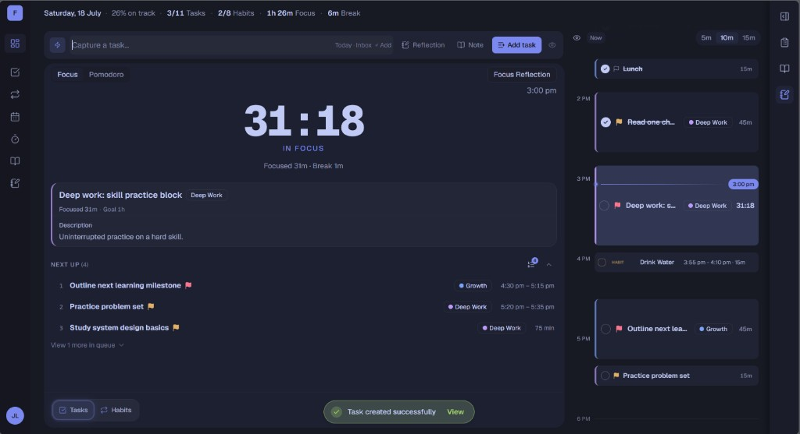
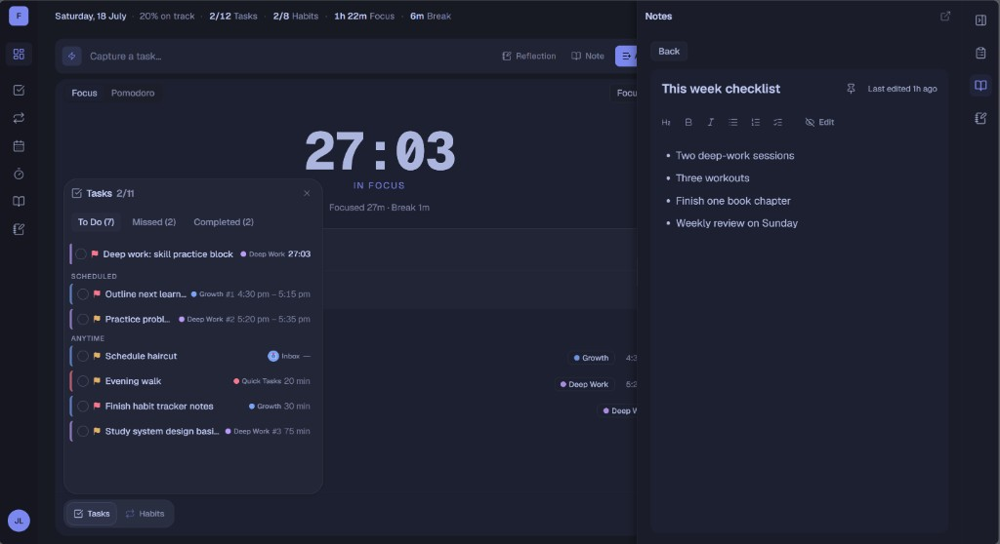
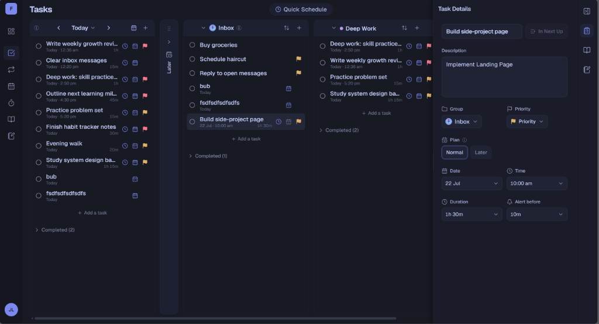
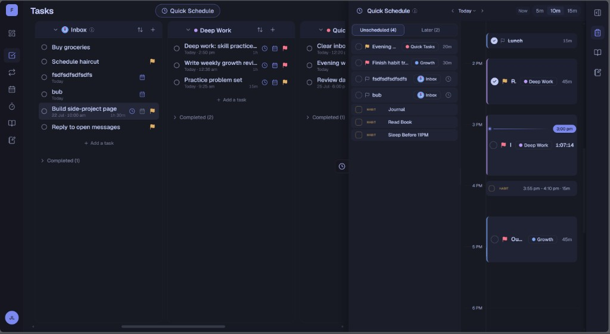
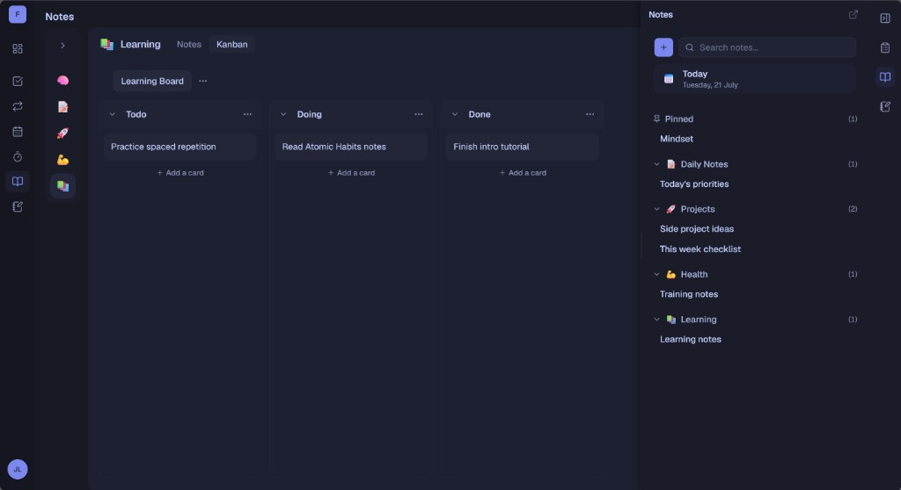

# FlowOS

A personal execution system that connects planning, focused work, progress, and reflection into one continuous workflow.

> Turn intention into execution.  
> Turn execution into progress.  
> Turn reflection into improvement.

**Live app:** [flowos-sage.vercel.app](https://flowos-sage.vercel.app)

<p align="center">
  
</p>

---

## What is FlowOS?

FlowOS is an integrated personal productivity platform designed around **execution** rather than organization alone.

Instead of treating tasks, schedules, focus sessions, habits, and reflection as separate tools, FlowOS connects them into one continuous workflow: plan meaningful work, execute with focus, review progress, and improve over time.

FlowOS began as a Final Year Project and continues to evolve toward a full personal execution system.

---

## Why FlowOS?

Modern productivity is fragmented.

People often plan work in one app, schedule it in another, focus somewhere else, and reflect in a journal. The relationship between those activities is often lost.

FlowOS exists to reconnect that chain.

Rather than helping you organize more tasks, FlowOS focuses on helping you **execute meaningful work** and continuously improve.

---

## Features

### Today

A centralized workspace for daily execution — capture, focus, Next Up, and the day’s timeline in one place.

### Tasks

Capture and organize actionable work across Today, Inbox, Later, and custom groups, with detail editing when you need it.

### Schedule

A visual timeline for intentional work, plus Quick Schedule to drag unscheduled tasks onto the day.

### Focus

Continuous focus sessions with break support, session tracking, and a clear view of what you’re executing now.

### Habits

Build consistent routines and keep them visible alongside the day’s work.

### Notes

Lightweight contextual notes and boards so writing stays close to execution.

### Reflection

Review what happened, understand why, and improve tomorrow.

---

## Screenshots

### Focus

Stay in session while tasks, habits, and notes stay within reach.



### Tasks

Board columns for Today, Inbox, and groups — with task details when you dig in.



### Schedule

Quick Schedule: unscheduled pool on the left, timeline on the right.



### Notes

Notes and boards for context without leaving the system.



---

## Tech Stack

**Next.js · React · TypeScript · Tailwind CSS · Supabase · Vercel**

PostgreSQL and auth via Supabase.

---

## Getting Started

```bash
git clone https://github.com/faiqrusli/FlowOS.git
cd FlowOS
npm install
```

Create `.env.local` with your Supabase keys (see [TECHNICAL_ARCHITECTURE.md](./docs/foundation/TECHNICAL_ARCHITECTURE.md)).

```bash
npm run dev
```

Open [http://localhost:3000](http://localhost:3000).

| Command | Purpose |
|---------|---------|
| `npm run dev` | Development server |
| `npm run build` | Production build |
| `npm run lint` | ESLint |

---

## Contributing

FlowOS is in an **implementation hold** for review — prefer small fixes and docs clarity over large new features.

See [CONTRIBUTING.md](./CONTRIBUTING.md) and [GIT_WORKFLOW.md](./docs/foundation/governance/GIT_WORKFLOW.md).

**Docs:** [docs/README.md](./docs/README.md) · **Shipped surface:** [FEATURE_INVENTORY.md](./docs/foundation/FEATURE_INVENTORY.md)

---

## Live Demo

**Production:** [https://flowos-sage.vercel.app](https://flowos-sage.vercel.app)

Guest live-demo workspace: [spec](./docs/review/design/flowos-live-demo-spec.md) · [runbook](./docs/execution/runbooks/flowos-live-demo.md)
