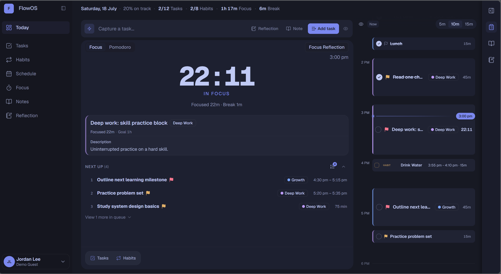
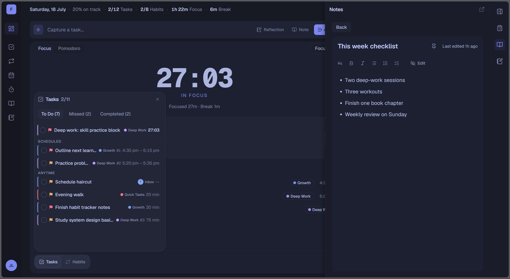
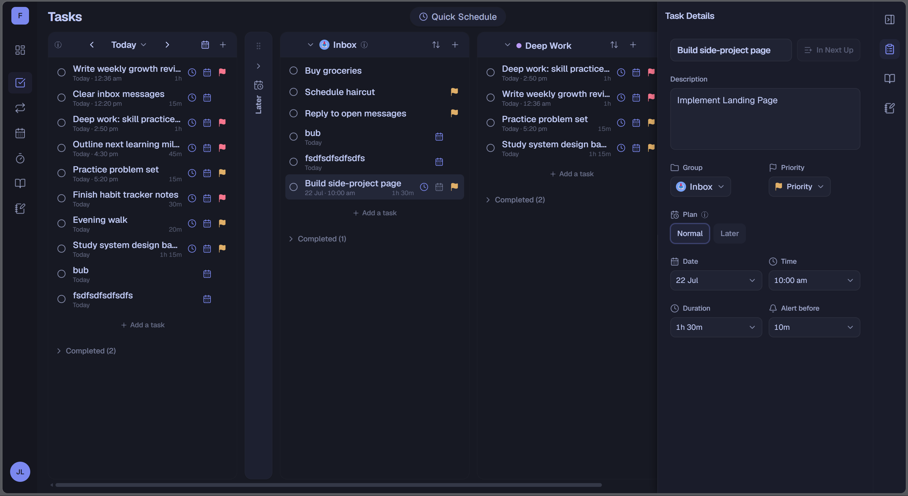
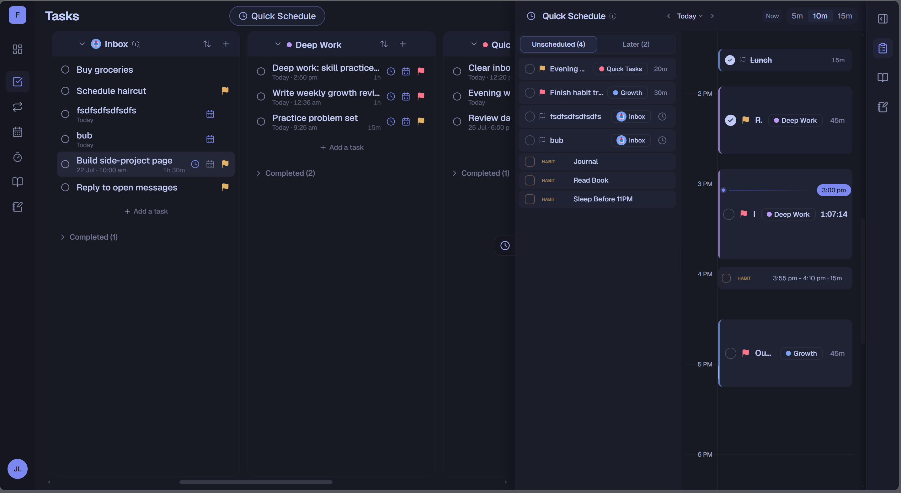
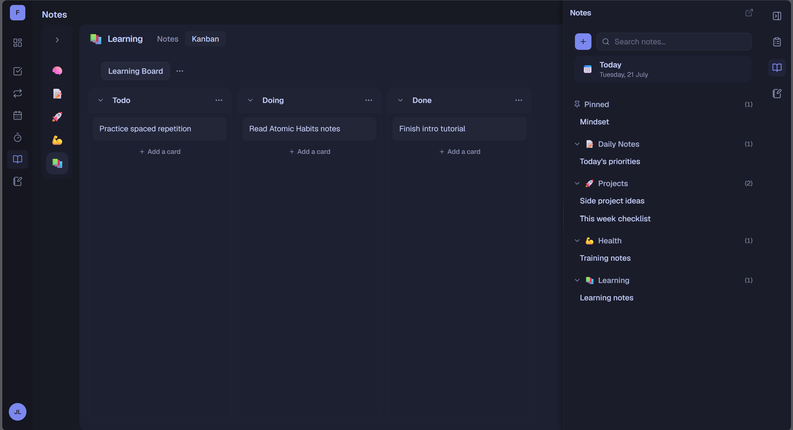

# FlowOS

**Your daily workspace for getting meaningful work done.**

FlowOS connects your tasks, schedule, focus sessions, habits, and reflection in one place — so you can plan your day, execute with focus, and actually learn what works for you.

**Live app:** [flowos-sage.vercel.app](https://flowos-sage.vercel.app)

<p align="center">
  
</p>

---

## What You Can Do

**Plan your day** — See what's on your plate, schedule tasks realistically, and know what to focus on next.

**Work with focus** — Start focus sessions that track what you're actually working on, not just what you planned.

**Build habits** — Track daily routines and see them right alongside your tasks.

**Reflect and improve** — End each day by capturing what worked, what didn't, and what to change tomorrow.

**Everything connects** — Your tasks flow into your schedule, your schedule drives your focus sessions, and your reflections help you plan better next time.

---

## Why FlowOS?

Most productivity tools are disconnected. You plan in one app, work in another, and reflect in your journal. FlowOS keeps it all together so you can actually see the relationship between what you plan and what you do.

Rather than helping you organize more tasks, FlowOS focuses on helping you **execute meaningful work** and continuously improve.

---

## How It Works

1. **Start your day** — Check Today to see your tasks, habits, and schedule
2. **Hit Focus** — Start a session and work distraction-free
3. **Track progress** — See what you're actually completing in real-time
4. **End with Reflection** — Capture what worked, what didn't, and adjust tomorrow
5. **Improve over time** — Your patterns help you plan better and work smarter

---

## Who Is FlowOS For?

- **Students** managing coursework, projects, and personal growth
- **Freelancers** balancing multiple clients and personal work
- **Knowledge workers** who want to do deep work with less friction
- **Anyone** tired of productivity tools that create more work than they solve

---

## Features

### Today

Central workspace for daily execution.

### Tasks

Manage work across Today, Inbox, Later, and Groups.

### Schedule

Plan work visually using timeline scheduling.

### Focus

Continuous focus sessions with execution tracking.

### Habits

Build consistent daily routines.

### Notes

Contextual notes and lightweight Kanban boards.

### Reflection

Review progress and improve tomorrow.

### Reminders

Task, habit, and focus reminders with browser notifications.

---

## Screenshots

### Focus

Stay in session while tasks, habits, and notes stay within reach.



### Tasks

Board columns for Today, Inbox, and groups — with task details when you dig in.



### Schedule

Quick Schedule: unscheduled pool on the left, timeline on the right.



### Notes

Notes and boards for context without leaving the system.



---

## Product vision

FlowOS aims to close the gap between **intention and execution** — built to execute work, not just organize it.

**Core loop:** Plan → Commit → Focus → Reflect → Improve

**Learn More:**
- [Vision](./docs/00-constitution/Vision.md) — Why FlowOS exists and product principles
- [Feature Inventory](./docs/04-features/FEATURE_INVENTORY.md) — What's built vs planned
- [User Evolution & Market Positioning](./docs/01-product/user-evolution-and-market-positioning.md) — Who we serve
- [Documentation Hub](./docs/README.md) — Full documentation

---

## Tech Stack

**Next.js · React · TypeScript · Tailwind CSS · Supabase · Vercel**

PostgreSQL and auth via Supabase.

---

## Getting Started

```bash
git clone https://github.com/faiqrusli/FlowOS.git
cd FlowOS
npm install
```

Create `.env.local` with your Supabase keys (see [TECHNICAL_ARCHITECTURE.md](./docs/06-engineering/TECHNICAL_ARCHITECTURE.md)).

```bash
npm run dev
```

Open [http://localhost:3000](http://localhost:3000).

| Command | Purpose |
|---------|---------|
| `npm run dev` | Development server |
| `npm run build` | Production build |
| `npm run lint` | ESLint |

---

## Contributing

Prefer small, evidence-backed changes over large new features. All contributions should align with the [Vision](./docs/00-constitution/Vision.md).

**New to FlowOS?** Start here:
- **[Start Here docs](./docs/start-here/)** — How FlowOS works and how to develop it
- **[Current Sprint](./docs/current-phase/current-sprint.md)** — What's being worked on right now
- **[Contributing Guide](./CONTRIBUTING.md)** — How to contribute
- **[Git Workflow](./docs/00-constitution/governance/GIT_WORKFLOW.md)** — Branch and commit conventions

**Quick Links:**
- [Documentation Hub](./docs/README.md) — Full documentation index
- [Vision](./docs/00-constitution/Vision.md) — Product philosophy and principles
- [Decision Register](./docs/08-decisions/decision-register.md) — Major decisions and rationale
- [Feature Inventory](./docs/04-features/FEATURE_INVENTORY.md) — What's shipped vs planned

---

## Live Demo

**Production:** [https://flowos-sage.vercel.app](https://flowos-sage.vercel.app)

Historical live-demo references: [spec](./docs/11-archive/review/design/flowos-live-demo-spec.md) · [runbook](./docs/11-archive/execution/runbooks/flowos-live-demo.md)
