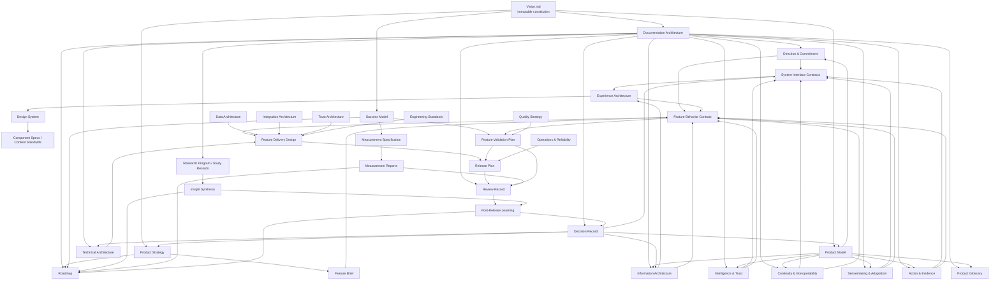

# Documentation Planning

**Status:** Superseded historical planning record
**Authority:** Historical account of the proposed documentation architecture; does not govern active FlowOS documentation
**Owner:** Product and documentation leadership
**Parent:** [Documentation Architecture](../../00-constitution/documentation-architecture.md)
**Children:** None; active implementation is governed by the Documentation Architecture and current folder indexes
**Last reviewed:** 2026-08-01
**Review trigger:** Historical correction only; any active documentation change belongs in the current documentation ecosystem.

---

> **Superseded:** The implemented documentation ecosystem is governed by [Documentation Architecture](./documentation-architecture.md), the [Document Map](../meta/document-map.md), and the active folder indexes. This planning record is retained only to preserve the history of the original proposed structure; its proposed paths, statuses, implementation order, and "next" indicators must not be used for current work.

---

## Organizing Principle

`Vision.md` remains immutable and is the sole constitutional authority. This architecture does not create a competing philosophy, product doctrine, or duplicate explanation of the Vision.

The central rule is simple: **each document answers one kind of question only.**

| Layer | Question |
|---|---|
| Constitution | Why must FlowOS exist and what must never change? |
| Product | What is the product, for whom, and what outcome must it create? |
| Systems | What enduring product mechanisms make that possible? |
| Experience | How do systems form one coherent user experience? |
| Features | What bounded capability is being introduced? |
| Design | How is the experience expressed consistently? |
| Engineering | How is it safely built and operated? |
| Strategy & delivery | What should happen next, and when? |
| Decisions | Why was a specific choice made? |
| Evidence & reviews | What happened, what was learned, and what must change? |

The Vision already owns the "why," beliefs, and timeless principles. There should be no standalone `Product Philosophy`, `Execution System`, or `Growth System` that restates it. Lower documents may cite the Vision; they must never paraphrase it into a second authority.

---

## Proposed Documentation Tree

```
docs/
  00-constitution/
    Vision.md
    documentation-architecture.md

  01-product/
    product-model.md
    product-glossary.md
    product-strategy.md
    success-model.md

  02-systems/
    direction-and-commitment.md
    action-and-evidence.md
    sensemaking-and-adaptation.md
    continuity-and-interoperability.md
    intelligence-and-trust.md
    contracts/
      <system-interface-contract>.md

  03-experience/
    information-architecture.md
    experience-architecture.md

  04-features/
    _template/
      feature-brief.md
      behavior-contract.md
      delivery-design.md
      validation-plan.md
    <feature-name>/
      feature-brief.md
      behavior-contract.md
      delivery-design.md
      validation-plan.md

  05-design/
    design-system.md
    components/
      <component-specification>.md
    content-standards.md

  06-engineering/
    technical-architecture.md
    data-architecture.md
    integration-architecture.md
    trust-architecture.md
    engineering-standards.md
    quality-strategy.md
    operations-and-reliability.md

  07-strategy-and-delivery/
    roadmap.md
    releases/
      <release-plan>.md

  08-decisions/
    decision-register.md
    records/
      <decision-record>.md

  09-evidence/
    research-program.md
    studies/
      <study-record>.md
    insight-syntheses/
      <insight-synthesis>.md
    measurement-specification.md
    measurement-reports/
      <measurement-report>.md

  09-reviews/
    reviews/
      <review-record>.md
    post-release/
      <post-release-learning-record>.md
```

`Vision.md` should eventually live in `00-constitution/` through a path-only move, with no content change. If its current location must remain immutable too, retain it where it is and treat `00-constitution/` as the conceptual root; do not create a copy.

---

## Document Catalog

### 00 — Constitution

| Document | Purpose and sole responsibility | Contains / explicitly excludes | Parent → children | Stability / style / length / why separate |
|---|---|---|---|---|
| `Vision.md` | Defines FlowOS's permanent purpose and non-negotiable constitutional authority. | Contains timeless intent, beliefs, principles, boundaries, north star. Excludes strategy, features, roadmap, implementation, current metrics. | None → every document. | Never changes; declarative; 3,000–5,000 words. Separate because no lower document may reinterpret it. |
| `documentation-architecture.md` | Defines where knowledge belongs and how documents inherit, change, link, and retire. | Contains authority rules, naming, ownership, lifecycle, templates, folder rules. Excludes product beliefs and implementation decisions. | Vision → every documentation family. | Rarely; precise and administrative; 2,000–3,000 words. Separate because it governs knowledge structure, not the product. |

### 01 — Product

| Document | Purpose and sole responsibility | Contains / explicitly excludes | Parent → children | Stability / style / length / why separate |
|---|---|---|---|---|
| `product-model.md` | Defines the conceptual model of the product. | Contains product entities, relationships, user responsibilities, conceptual boundaries. Excludes rationale already in Vision, UI, schemas, and feature detail. | Vision → systems, experience architecture, feature briefs. | Occasionally; precise conceptual prose and diagrams; 2,000–4,000 words. Separate because it answers "what is FlowOS?" rather than "why?" |
| `product-glossary.md` | Owns canonical product vocabulary. | Contains terms, definitions, approved names, deprecated names. Excludes principles, workflows, and explanations of system behavior. | Product Model → every document. | Occasionally; terse reference; 500–1,500 words. Separate because terminology must have one source. |
| `product-strategy.md` | Defines current market choices. | Contains target users, positioning, category, differentiation hypotheses, business constraints. Excludes permanent philosophy, feature specifications, and delivery sequencing. | Vision + Product Model → roadmap, research program, feature briefs. | Occasionally; decision-oriented; 1,500–3,000 words. Separate because market choices are revisable while Vision is not. |
| `success-model.md` | Defines what success means and how it is measured. | Contains outcome definitions, metric ownership, metric formulas, leading/lagging indicators, anti-metrics. Excludes event instrumentation and actual results. | Vision + Product Strategy → validation plans, measurement specification, roadmap. | Occasionally; exact and quantitative; 1,500–2,500 words. Separate because desired outcomes are not evidence. |

### 02 — Systems

Each system document defines an enduring product mechanism. It describes responsibilities, inputs, outputs, invariants, failure modes, and system-level user outcomes. It does not describe pages, components, database tables, or a delivery sequence.

| Document | Purpose and sole responsibility | Contains / explicitly excludes | Parent → children | Stability / style / length / why separate |
|---|---|---|---|---|
| `direction-and-commitment.md` | Defines how chosen direction becomes an active commitment. | Contains conceptual rules and boundaries for direction and commitment. Excludes action tracking and interface flows. | Product Model → related feature contracts, interface contracts. | Rarely; systems prose and diagrams; 1,500–2,500 words. Separate because direction and commitment have different invariants from action. |
| `action-and-evidence.md` | Defines how deliberate action and its evidence are represented. | Contains evidence semantics, accuracy rules, distinctions between intention and occurrence. Excludes reflection and inference. | Product Model → related feature contracts, data architecture. | Rarely; precise systems prose; 1,500–2,500 words. Separate because factual records must not be mixed with interpretation. |
| `sensemaking-and-adaptation.md` | Defines how context, reflection, learning, and adaptation relate. | Contains interpretation boundaries and adaptation outcomes. Excludes AI implementation and action capture. | Product Model → related feature contracts, intelligence system. | Rarely; careful explanatory prose; 1,500–2,500 words. Separate because learning is not the same as evidence. |
| `continuity-and-interoperability.md` | Defines FlowOS's role across external tools and personal history. | Contains source ownership, portability, continuity rules, integration boundaries. Excludes provider-specific API details. | Product Model → system contracts, integration architecture. | Rarely; policy-oriented systems prose; 1,500–2,500 words. Separate because interoperability is a product responsibility, not merely an API concern. |
| `intelligence-and-trust.md` | Defines constraints on system intelligence, recommendations, and trust. | Contains evidence requirements, explainability, correction, consent, uncertainty, human authority. Excludes model selection and implementation. | Product Model + system documents → AI feature contracts, trust architecture. | Rarely; normative and exact; 1,500–2,500 words. Separate because intelligence must remain subordinate to the constitutional product boundaries. |
| `contracts/<system-interface-contract>.md` | Defines one shared semantic contract between two systems. | Contains shared terms, ownership, events, handoffs, invariants. Excludes either system's full behavior or code-level APIs. | Relevant system documents → feature delivery designs, data/integration architecture. | Occasionally; tabular contract; 500–1,500 words. Separate because cross-system rules should not be buried in either parent system. |

### 03 — Experience

| Document | Purpose and sole responsibility | Contains / explicitly excludes | Parent → children | Stability / style / length / why separate |
|---|---|---|---|---|
| `information-architecture.md` | Defines where information and capabilities live. | Contains surface hierarchy, navigation, findability, ownership of surfaces, entry/exit rules. Excludes visual design, interactions, and system rules. | Product Model + systems → feature behavior contracts. | Occasionally; diagrams and concise rules; 1,500–3,000 words. Separate because location is different from behavior. |
| `experience-architecture.md` | Defines cross-surface experience patterns. | Contains journey transitions, state continuity, interruption/recovery patterns, shared interaction rules. Excludes navigation map, component styling, and feature-specific behavior. | Systems + IA → feature behavior contracts, design system. | Occasionally; journey diagrams and scenarios; 1,500–3,000 words. Separate because the experience between surfaces needs one owner. |

### 04 — Features

Every feature receives a folder only after a strategic decision to explore or build it. A feature never creates a second system model.

| Document | Purpose and sole responsibility | Contains / explicitly excludes | Parent → children | Stability / style / length / why separate |
|---|---|---|---|---|
| `feature-brief.md` | States the decision problem and intended outcome. | Contains user problem, desired outcome, scope, non-goals, dependencies, success hypothesis. Excludes final behavior and implementation. | Product Strategy + systems → behavior contract, validation plan. | Occasionally until approved; concise decision memo; 500–1,000 words. Separate because "should we build it?" precedes "how should it work?" |
| `behavior-contract.md` | Defines the externally observable behavior of one feature. | Contains user-visible states, rules, edge cases, permissions, accessibility expectations. Excludes rationale, schema, architecture, rollout. | Feature Brief + systems + IA → delivery design, review record. | Rarely after approval; exact specification; 1,000–3,000 words. Separate because behavior is the agreement users and teams rely on. |
| `delivery-design.md` | Defines the feature-specific implementation approach. | Contains affected services, data changes, integration changes, migration and rollout approach, technical risks. Excludes product rationale and acceptance results. | Behavior Contract + engineering architecture → release plan. | Frequently while active; technical design; 1,000–2,500 words. Separate because implementation can change without reopening product behavior. |
| `validation-plan.md` | Defines how the feature will be judged before release. | Contains acceptance criteria, test cases, measurement links, rollout checks. Excludes implementation details and actual results. | Feature Brief + Behavior Contract + Success Model → review record, measurement report. | Occasionally; testable checklist; 500–1,500 words. Separate because expected evidence must exist before implementation begins. |

### 05 — Design

| Document | Purpose and sole responsibility | Contains / explicitly excludes | Parent → children | Stability / style / length / why separate |
|---|---|---|---|---|
| `design-system.md` | Defines shared visual and interaction foundations. | Contains tokens, layout principles, accessibility foundations, shared component categories. Excludes feature layouts and product IA. | Experience Architecture → component specifications, feature behavior contracts. | Rarely; visual reference and rules; 2,000–4,000 words. Separate because design consistency is a shared system, not feature documentation. |
| `components/<component-specification>.md` | Defines one reusable component's contract. | Contains anatomy, variants, states, accessibility, content slots, usage rules. Excludes visual foundations and feature journeys. | Design System → feature designs, implementation. | Occasionally; annotated reference; 300–1,000 words each. Separate because components evolve independently. |
| `content-standards.md` | Defines product-interface language. | Contains voice, grammar, terminology use, errors, empty states, permission language, AI disclosure language. Excludes product vocabulary definitions and marketing copy. | Product Glossary + Experience Architecture → feature behavior contracts. | Occasionally; examples and rules; 1,000–2,000 words. Separate because interface language is a design system, not a product model. |

### 06 — Engineering

| Document | Purpose and sole responsibility | Contains / explicitly excludes | Parent → children | Stability / style / length / why separate |
|---|---|---|---|---|
| `technical-architecture.md` | Defines the deployable software structure. | Contains applications, services, boundaries, dependencies, runtime topology. Excludes data ownership, security policy, and individual delivery plans. | System contracts → feature delivery designs. | Occasionally; diagrams and concise rationale; 2,000–4,000 words. Separate because software structure is not data architecture. |
| `data-architecture.md` | Defines data ownership, lifecycle, and canonical sources. | Contains domains, schemas, retention, migration rules, data lineage. Excludes user-facing system semantics and provider APIs. | Systems + system contracts → feature delivery designs. | Occasionally; tables and diagrams; 2,000–4,000 words. Separate because data truth needs a single owner. |
| `integration-architecture.md` | Defines technical integration patterns. | Contains API patterns, synchronization, failure handling, provider boundaries, versioning. Excludes product-level interoperability policy. | Continuity System + system contracts → feature delivery designs. | Occasionally; contracts and sequence diagrams; 1,500–3,000 words. Separate because provider mechanics change faster than product intent. |
| `trust-architecture.md` | Defines technical privacy, security, and authorization design. | Contains identity, access control, encryption, auditability, consent implementation, threat boundaries. Excludes constitutional AI or privacy beliefs. | Intelligence and Trust System → delivery designs, reviews. | Rarely; exact controls and diagrams; 2,000–4,000 words. Separate because trust requirements must be independently auditable. |
| `engineering-standards.md` | Defines how engineers change the product safely. | Contains coding conventions, review expectations, dependency policy, branching, documentation update rules. Excludes architecture and test strategy. | Documentation Architecture + Engineering Architecture → delivery designs. | Occasionally; imperative handbook; 1,500–3,000 words. Separate because working practice is not system structure. |
| `quality-strategy.md` | Defines how product and technical quality are verified. | Contains test pyramid, test ownership, acceptance levels, accessibility verification, release quality gates. Excludes live operational response. | Validation Plans + Engineering Standards → review records. | Occasionally; measurable policy; 1,500–3,000 words. Separate because proving correctness differs from operating a live system. |
| `operations-and-reliability.md` | Defines how the live product remains dependable. | Contains monitoring, alerts, backups, incident response, SLOs, recovery and runbooks. Excludes test design and feature behavior. | Technical + Data + Trust Architecture → release plans, reviews. | Frequently; operational runbook; 2,000–4,000 words. Separate because runtime stewardship changes independently of code standards. |

### 07 — Strategy and Delivery

| Document | Purpose and sole responsibility | Contains / explicitly excludes | Parent → children | Stability / style / length / why separate |
|---|---|---|---|---|
| `roadmap.md` | Sequences validated strategic bets across horizons. | Contains desired outcomes, dependencies, confidence, sequencing, explicit deferrals. Excludes release checklists and feature behavior. | Product Strategy + Success Model + evidence → feature briefs, release plans. | Frequently; outcome-based planning; 1,500–3,000 words. Separate because sequence is not product definition. |
| `releases/<release-plan>.md` | Coordinates one bounded release. | Contains scope links, readiness owners, rollout, rollback, support, communication, dates. Excludes roadmap rationale and feature specifications. | Roadmap + Delivery Designs + Operations → reviews, post-release learning. | Frequently while active; operational checklist; 500–1,500 words. Separate because releases are temporary coordination artifacts. |

### 08 — Decisions

| Document | Purpose and sole responsibility | Contains / explicitly excludes | Parent → children | Stability / style / length / why separate |
|---|---|---|---|---|
| `decision-register.md` | Makes every active decision discoverable. | Contains ID, title, status, owner, date, domain, links. Excludes decision rationale. | Documentation Architecture → Decision Records. | Frequently; index only; under 1,000 words. Separate because discovery should not dilute decision records. |
| `records/<decision-record>.md` | Preserves one irreversible or consequential choice and its rationale. | Contains context, options, evidence, decision, consequences, review trigger. Excludes implementation plans and retrospective results. | Relevant parent document → changed child documents. | Never after acceptance; append-only; 300–1,000 words. Separate because decisions are historical records, not living specifications. |

### 09 — Evidence

| Document | Purpose and sole responsibility | Contains / explicitly excludes | Parent → children | Stability / style / length / why separate |
|---|---|---|---|---|
| `research-program.md` | Defines how FlowOS conducts user research responsibly. | Contains recruitment, methods, consent, ethics, research cadence, evidence standards. Excludes findings. | Product Strategy → Study Records. | Occasionally; methodological handbook; 1,000–2,000 words. Separate because method must not be contaminated by desired findings. |
| `studies/<study-record>.md` | Preserves one bounded research study. | Contains research question, participants, protocol, observations, raw findings, limitations. Excludes strategic recommendations. | Research Program → Insight Synthesis, Review Record. | Never after close; factual study record; 1,000–3,000 words. Separate because evidence is not interpretation. |
| `insight-syntheses/<insight-synthesis>.md` | Interprets evidence across multiple studies. | Contains recurring patterns, confidence, contradictions, unanswered questions. Excludes roadmap commitments and decisions. | Study Records → Product Strategy, Roadmap, Decision Records. | Occasionally; analytical; 1,000–2,500 words. Separate because synthesis must remain distinct from raw evidence. |
| `measurement-specification.md` | Defines how success metrics are instrumented. | Contains event definitions, data quality rules, ownership, calculation implementation. Excludes metric meaning and results. | Success Model → Measurement Reports, Validation Plans. | Occasionally; technical reference; 1,000–2,000 words. Separate because instrumentation is not strategy. |
| `measurement-reports/<measurement-report>.md` | Records a time-bounded set of metric results. | Contains period, cohort, values, caveats, anomalies. Excludes interpretation beyond factual commentary and decisions. | Measurement Specification → Insights, Reviews. | Never after publication; factual report; 500–1,500 words. Separate because results must not be rewritten to fit a narrative. |

### 10 — Reviews

| Document | Purpose and sole responsibility | Contains / explicitly excludes | Parent → children | Stability / style / length / why separate |
|---|---|---|---|---|
| `reviews/<review-record>.md` | Assesses a bounded artifact, feature, release, or system against its existing contract. | Contains scope, criteria, evidence, findings, severity, required disposition. Excludes replacement specifications or future roadmap. | Specifications + evidence + quality strategy → Decision Records, Post-Release Learning. | Never after close; evaluative; 500–2,000 words. Separate because review judges a contract; it does not rewrite it. |
| `post-release/<post-release-learning-record>.md` | Captures what a release taught FlowOS after it met real conditions. | Contains expected versus observed outcome, incidents, user evidence, metric evidence, follow-up questions. Excludes blame, raw study data, and new specifications. | Release Plan + Reviews + Evidence → Roadmap, Insights, Decision Records. | Never after close; candid learning memo; 1,000–2,500 words. Separate because deployment learning is neither a release plan nor a review. |

---

## Dependency Graph



Evidence can cause a lower document to be revised, or produce a decision record. It cannot override the Vision. A decision record also cannot override the Vision; it can only resolve a permitted choice within it.

---

## Implementation Order

This is the order for creating the ecosystem later. It is not an instruction to write the documents now.

1. **`documentation-architecture.md`**  
   Establishes ownership, authority, lifecycle, naming, and templates before new documentation proliferates.

2. **`product-model.md`**  
   Defines the shared product vocabulary and conceptual boundaries that every system document requires.

3. **`product-glossary.md`**  
   Prevents terminology drift before systems, features, design, and engineering begin using different names for the same thing.

4. **`product-strategy.md` and `success-model.md`**  
   Establish current market choices and measurable outcomes before prioritization begins.

5. **The five system documents**  
   Define enduring product mechanisms before any feature attempts to solve a local problem independently.

6. **System interface contracts**  
   Make shared ownership and handoffs explicit before cross-system features or technical architecture harden accidental assumptions.

7. **`information-architecture.md` and `experience-architecture.md`**  
   Translate systems into a coherent product experience before individual feature surfaces are designed.

8. **Design system, content standards, and component specifications**  
   Establish reusable expression rules before feature-level design creates inconsistency.

9. **Engineering architecture, standards, quality strategy, and operations**  
   Define safe implementation and operating constraints before delivery designs are written.

10. **Feature templates, decision record template, research program, and measurement specification**  
    Create the reusable operating machinery before the team starts generating feature, evidence, and decision documents.

11. **Feature dossiers**  
    Create them only when a feature enters discovery or delivery. Each must inherit from the system, experience, design, and engineering layers above it.

12. **Roadmap and release plans**  
    Write the roadmap only after strategic choices, success measures, and system dependencies are explicit. Create release plans only when a roadmap item is ready to ship.

13. **Studies, measurement reports, reviews, and post-release learning records**  
    These are continuous records created by real work and real users. They feed future decisions and roadmap revisions without becoming competing product authorities.

---

## Current Implementation Progress

**Implemented through 2026-08-01:**

- ✅ `Vision.md` (docs/00-constitution/Vision.md)
- ✅ `product-model.md` (docs/01-product/product-model.md)
- ✅ `product-glossary.md` (docs/01-product/product-glossary.md)
- ✅ `direction-and-commitment.md` (docs/02-systems/direction-and-commitment.md)
- ✅ `action-and-evidence.md` (docs/02-systems/action-and-evidence.md)
- ✅ `sensemaking-and-adaptation.md` (docs/02-systems/sensemaking-and-adaptation.md)
- ✅ `continuity-and-interoperability.md` (docs/02-systems/continuity-and-interoperability.md)

**Next:** `intelligence-and-trust.md`

---

## Result

The result is a documentation system in which no one needs to ask, "Where should this go?" The kind of knowledge determines the document, the parent determines its authority, and the document's exclusions prevent duplication.
