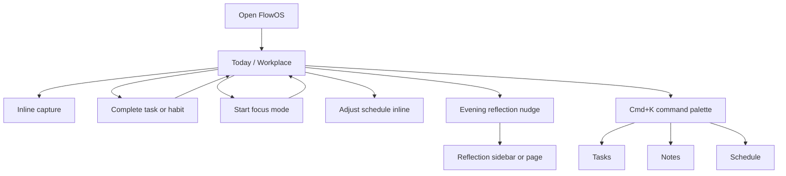

# Information Architecture

> **Status: Superseded (July 4, 2026)** — IA content merged into [FEATURE_INVENTORY.md](../../foundation/FEATURE_INVENTORY.md) (Information architecture section). Historical copy preserved.

**Status:** Archived  
**Audience:** Designers, engineers, product lead  
**Last updated:** July 3, 2026

---

## Purpose

Define how FlowOS modules relate, how users navigate between them, and the **target information architecture** after Phase 3 — when Today becomes the gravitational center.

Module purposes are documented here (no separate MODULE_PURPOSES.md).

---

## Current IA (July 2026 — pre-Phase 3)

### Navigation model

Eight sidebar items with **equal visual weight** — no hierarchy.

```
Overview
  └── Dashboard (/)          ← default landing (read-only intelligence)

Productivity
  ├── Workplace (/workplace) ← actual execution surface
  ├── Schedule (/schedule)
  ├── Tasks (/tasks)
  ├── Habits (/habits)
  ├── Focus (/focus)
  ├── Reflection (/reflection)
  └── Notes (/notes)
```

Source: `flowos/src/config/sidebar-navigation.tsx`

### Problem diagnosis

| Issue | Impact |
|-------|--------|
| Dashboard at `/`, Workplace at `/workplace` | Users land on intelligence; work happens elsewhere |
| Eight equal nav items | 20–50 module switches per active day |
| Three scheduling surfaces | Tasks drawer, Schedule page, Workplace timeline |
| Focus as destination page | Next-action routes to `/focus` instead of in-place timer |
| No command layer | Users hunt for entities across modules |

Source: [../archive/design/ux-friction-review.md](../archive/design/ux-friction-review.md)

---

## Target IA (post Phase 3.1–3.6)

### Hierarchy principle

**Primary → Secondary → Tertiary.** Not all modules deserve equal nav prominence.

### Target navigation

```
Today (/)                    ← PRIMARY: execution + inline intelligence
  ├── Focus mode (overlay)   ← mode, not page
  ├── Inline capture bar
  ├── Timeline (default scheduling surface)
  └── Next action (in-place, not routed away)

Overview (/overview)         ← SECONDARY: optional KPI summary (demoted Dashboard)

Tasks (/tasks)               ← SECONDARY: board organization, deep editing
Habits (/habits)             ← SECONDARY: habit management
Focus (/focus)               ← SECONDARY: history & analytics only
Reflection (/reflection)     ← SECONDARY: full reflection editor

Schedule (/schedule)         ← TERTIARY: fullscreen timeline (action from Today)
Notes (/notes)               ← TERTIARY: archives, kanban, long-form notes
```

### Target user flow



---

## Module purposes and Phase 3 verdict

### Dashboard → Overview (demote)

| | |
|---|---|
| **Why it exists** | Centralized KPIs, next-action computation ([thesis Ch.1](../archive/project/01-introduction.md)) |
| **SRL phase** | Performance (monitoring) |
| **Verdict** | Merge intelligence into Today; demote to optional `/overview` |
| **Overlap** | Workplace execution, Focus stats |

### Workplace → Today (promote to home)

| | |
|---|---|
| **Why it exists** | Daily execution: timer, timeline, tasks, habits |
| **SRL phase** | Performance |
| **Verdict** | **Become default home `/`** |
| **Overlap** | Dashboard, Schedule embed, Focus timer |

### Tasks (keep, demote)

| | |
|---|---|
| **Why it exists** | GTD capture and clarify; board organization |
| **SRL phase** | Forethought |
| **Verdict** | Keep; access via command palette + inline capture as primary |
| **Overlap** | Schedule drawer, Workplace quick-add |

### Schedule (keep, demote)

| | |
|---|---|
| **Why it exists** | Fullscreen timeline planner |
| **SRL phase** | Forethought (organize) |
| **Verdict** | Tertiary — "Open fullscreen timeline" action from Today |
| **Overlap** | Tasks drawer, Workplace timeline |

### Habits (keep, inline)

| | |
|---|---|
| **Why it exists** | Habit formation and daily tracking ([Ch.2](../archive/project/02-related-works.md)) |
| **SRL phase** | Forethought + Performance |
| **Verdict** | Keep; primary completion on Today; `/habits` for management |
| **Overlap** | Schedule items, Focus (`track_with_focus`) |

### Focus (reframe)

| | |
|---|---|
| **Why it exists** | Pomodoro/deep work; session tracking ([Ch.2](../archive/project/02-related-works.md)) |
| **SRL phase** | Performance |
| **Verdict** | **Mode on Today**; `/focus` = history and analytics only |
| **Overlap** | Workplace timer card |

### Reflection (keep, essential)

| | |
|---|---|
| **Why it exists** | SRL self-reflection phase — core differentiator |
| **SRL phase** | Self-reflection |
| **Verdict** | Keep; unify save behavior; evening nudge on Today |
| **Overlap** | Notes, Workplace daily note card |

### Notes (keep, secondary)

| | |
|---|---|
| **Why it exists** | FE-2 Daily Notes; ideas and records |
| **SRL phase** | Self-reflection (supplementary) |
| **Verdict** | Keep secondary; do not expand kanban during Phase 3 |
| **Overlap** | Workplace daily note, Reflection |

---

## Scheduling surfaces (consolidation plan)

| Surface | Current role | Phase 3 target |
|---------|--------------|----------------|
| Workplace timeline | Embedded on Today | **Default** scheduling surface |
| Tasks quick schedule drawer | Board-level scheduling | Secondary; smart defaults |
| Schedule fullscreen page | Dedicated planner | Tertiary; opened via action |

**User feeling target:** "I plan by dragging time, not by learning the system."

---

## Capture paths (consolidation plan)

| Path | Current | Phase 3 target |
|------|---------|----------------|
| Quick capture dialog | Modal, tasks-only, global shortcut | Secondary |
| Inline capture bar | Not built | **Primary** — type → Enter |
| Workplace quick add | On Today card | Keep as secondary |
| Task dialog | Full create/edit | Deep editing only |

---

## Command layer (new in Phase 3.2)

| Capability | Priority |
|------------|----------|
| Search tasks, habits, notes, reflections | P0 |
| Jump to module or entity | P0 |
| Trigger actions (start focus, add task) | P1 |
| Shortcut cheat sheet (`?`) | P1 |

---

## Routes to hide or remove (pre-alpha)

| Route | Action |
|-------|--------|
| `/goals` | Hide until FE-1 scoped |
| `/ai-coach` | Hide or 404 until FE-4 scoped |
| Fake Agenda card on Workplace | Remove or wire to real "Plan tomorrow" |

---

## Phase 3.1 MVP bundle (IA changes)

Minimum IA shift for private alpha:

1. Today (`/` or `/workplace` unified) as default home  
2. Dashboard intelligence inline on Today  
3. Next-action executes in place — fixed deep links  
4. Remove fake Agenda card  
5. Command palette v1 (search + jump)  

Full breakdown: [../archive/design/roadmap-pre-masterplan.md](../archive/design/roadmap-pre-masterplan.md) Phase 3.1–3.2

---

## Related documents

- [governance/PRINCIPLES.md](./governance/PRINCIPLES.md) — SRL cycle and hierarchy principles  
- [FEATURE_INVENTORY.md](./FEATURE_INVENTORY.md) — feature status by module  
- [../archive/design/ux-friction-review.md](../archive/design/ux-friction-review.md) — friction diagnosis  
- [../archive/design/roadmap-pre-masterplan.md](../archive/design/roadmap-pre-masterplan.md) — Phase 3 implementation plan  
