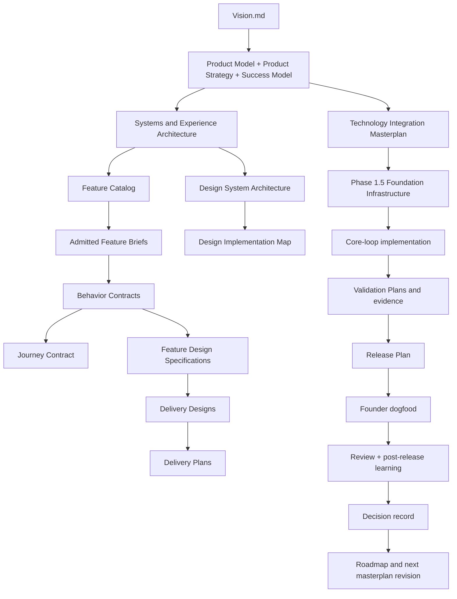

# FlowOS MVP Implementation Masterplan

**Status:** Active — canonical implementation source for the pre-dogfood MVP
**Authority:** Current sequence of product, design, engineering, validation, and release work required before FlowOS is offered to real users
**Owner:** Product Architect + Engineering Architect
**Approval Required:** Founder
**Parent:** [Vision.md](../00-constitution/Vision.md) · [Product Model](../01-product/product-model.md) · [Roadmap](../07-strategy-and-delivery/roadmap.md) · [Documentation Architecture](../00-constitution/documentation-architecture.md)
**Children:** Delivery plans, feature dossiers, design specifications, engineering designs, validation plans, release plans, decisions, and reviews
**Last Updated:** 2026-08-05
**Review trigger:** A change to the MVP boundary, an evidence gate, a phase dependency, a feature disposition, or the readiness decision for founder or external dogfood.

---

## Document Ownership

### Owner
**Role:** Product Architect + Engineering Architect
**Responsibility:** Product Architect maintains product sequencing and feature admission; Engineering Architect maintains technical implementation order and delivery design

### Modification Process
1. Product Architect proposes product-level changes (feature admission, phase sequencing, evidence gates)
2. Engineering Architect proposes technical-level changes (implementation order, delivery design, validation requirements)
3. Both architects review cross-functional implications
4. Submit to Founder for approval
5. Founder reviews for Vision and strategic alignment
6. If approved: Product Architect and Engineering Architect update document
7. Document change in decision record if consequential
8. Update Last Updated date

### Authority Level
- Product Architect can: Propose feature admission, phase sequencing, evidence gates
- Engineering Architect can: Propose implementation order, technical requirements, validation criteria
- Requires approval for: Changes to MVP boundary, phase dependencies, or feature disposition

---

## 1. Why this masterplan exists

FlowOS has a substantial working implementation, but it is not yet ready for dogfood under the current Vision. The product direction changed after many of the older milestone plans were written. Continuing to implement from those plans would turn historical assumptions into accidental requirements.

This masterplan is therefore the new source of the next implementation roadmap. It converts the current product model into an evidence-gated sequence for one coherent MVP. It is intentionally narrower than the existing application surface: a route, placeholder, or old future enhancement is not automatically part of MVP.

The [Roadmap](../07-strategy-and-delivery/roadmap.md) remains the authority for outcome sequence and investment governance. This document owns the implementation order that earns each Roadmap gate. A delivery plan may coordinate one bounded phase, but it may not skip a gate or admit a feature that this document has not admitted.

## 2. The MVP outcome

The MVP is the smallest trustworthy product that lets a person:

1. establish or revisit meaningful direction;
2. make a bounded present commitment;
3. take or resume an action;
4. see what actually occurred;
5. make sense of that evidence; and
6. deliberately adapt what comes next.

The MVP is not a complete personal operating system, a universal workspace, an automatic planner, an AI companion, or a catalogue of every future module. It must make the product's core loop coherent before it adds breadth.

## 3. Authority and non-negotiable gates

Implementation must be read in this order:

```text
Vision
  -> Product Model, Product Strategy, Success Model
  -> Systems and Experience Architecture
  -> Feature Catalog and admitted feature contracts
  -> Design and Engineering contracts
  -> This masterplan's phase gate
  -> Delivery plan and release plan
  -> Validation evidence and review
```

No phase is complete because code merged, a route renders, or a visual pass looks polished. A phase is complete only when its gate evidence is recorded and the next phase is explicitly admitted.

## 4. MVP feature admission

The [Feature Catalog](../04-features/feature-catalog.md) is the current implementation inventory. The following dispositions are the starting boundary for this plan; they are not permanent product decisions outside the evidence and decision process.

| Domain | MVP disposition | Admission condition |
|---|---|---|
| **Today** | **Admit — primary entry and reorientation** | It must expose grounded current context and a valid next action without becoming a forced ritual. |
| **Tasks** | **Admit — commitment and action** | Create, revise, select, complete, defer, and recover must have one coherent behavior contract. |
| **Focus** | **Admit — action mode** | Focus must preserve the identity and state of the action; elapsed focus time must not be presented as proof of outcome. |
| **Reflection** | **Admit — sensemaking/adaptation** | Daily and session-end capture must have one understandable save, correction, and recovery model. |
| **Habits** | **Conditional supporting path** | Retain only the behaviors that strengthen the core loop without creating a second product model. |
| **Schedule** | **Conditional supporting context** | Reconcile overlapping scheduling surfaces and keep planning distinct from evidence of action. |
| **Notes / Knowledge** | **Conditional supporting context** | Keep user-owned context and source relationships useful without turning FlowOS into a universal knowledge base. |
| **Growth Areas** | **Embedded in Notes** | Do not promote to a top-level feature unless a distinct need, outcome, and ownership boundary are evidenced. |
| **Goals** | **Deferred** | Re-admit only through a direction-system decision and evidence that the core loop needs it. The current route is a placeholder. |
| **Progress** | **Derived, not a destination** | Define evidence and measurement meaning first; do not build a score or standalone dashboard by default. |
| **AI Coach** | **Deferred** | Requires an explicit intelligence/trust decision, bounded authority, user control, evaluation, and a demonstrated need. The current route is a placeholder. |

MVP admission is a product decision, not an engineering convenience. If evidence changes the boundary, update this table through a decision record and revise the relevant feature catalog entry.

## 5. Phase sequence

### Phase 0 — Freeze ambiguity and establish document authority

**Purpose:** Stop implementation from drifting between the changed Vision, the current code, and legacy plans.

**Deliverables:**

- this masterplan adopted as the implementation source;
- [Feature Catalog](../04-features/feature-catalog.md) adopted as the current feature coverage map;
- [Design Implementation Map](../05-design/design-implementation-map.md) adopted as the current design reconciliation;
- [Documentation Refinement Plan](../11-archive/strategy/documentation-refinement-plan.md) started;
- legacy folders and files (including old specs, review materials, M2 runbooks, recruiting ops, and legacy logs) archived to `docs/11-archive/` and removed from active directories;
- superseded strategy material, including the former execution masterplan, archived under `docs/11-archive/strategy/` and not used to start work;
- fresh August 2026 operations setup established with active developer logging rules;
- a clean list of unresolved implementation truth, not a new speculative backlog.

**Gate 0 — Authority aligned:** Every proposed MVP work item points to a feature domain, parent system, design/engineering contract, and this masterplan phase. Work that cannot do so pauses.

### Phase 1 — Establish implementation truth

**Purpose:** Determine what the current build actually does before changing it.

**Work:**

- verify routes, entry points, data ownership, persistence, permissions, and current error/recovery behavior;
- reconcile the Feature Catalog with code and the detailed `04-features/FEATURE_INVENTORY.md` reference;
- reconcile V3/Tokyo Night Warm references, CSS tokens, component usage, and legacy design material;
- identify dead code, placeholder routes, duplicate scheduling surfaces, dual save paths, and undocumented states;
- run baseline quality, accessibility, security, and production checks;
- create only the feature briefs and behavior contracts needed to describe admitted MVP behavior.
- execute the accepted post-Phase-0 documentation improvements in parallel without turning them into blanket Gate 1 criteria;
- use the [current sprint](./current-sprint.md) as the dated execution plan and the [Gate 1 checklist](./phase-1/gate-checklist.md) as the evidence register and decision record.

**Gate 1 — Current build truth:** For every admitted MVP domain, the team can demonstrate the current behavior, data path, known gaps, and owner. Unknown status is not allowed to pass into implementation. Evidence: [Phase 1 implementation-truth evidence](./phase-1/implementation-truth-evidence.md) · [D-007 Gate 1 decision](../08-decisions/records/D-007-gate-1-current-build-truth-and-phase-2-authorization.md).

**Phase 1 execution boundary:** Phase 1 establishes current truth; it does not implement new MVP breadth. P0/P1 changes are permitted only when required to make behavior, data integrity, security, or recovery truth safe and demonstrable. Validation-library, form-management, and date/time integration are Phase 1.5 work governed by the [Technology Integration Masterplan](../06-engineering/technology-integration-masterplan.md), not hidden Gate 1 requirements.

### Phase 1.5 — Foundation Infrastructure

**Status:** COMPLETE — Gate 1.5 PASSED 2026-08-05; archived to `docs/11-archive/phases/phase-1.5/`; Phase 2 authorized
**Purpose:** Establish core engineering infrastructure before MVP loop implementation to ensure consistent patterns for validation, forms, and date/time handling across all surfaces.

**Technology authority:** [Technology Integration Masterplan](../06-engineering/technology-integration-masterplan.md). **Decision:** [D-004](../08-decisions/records/D-004-add-phase-1-5-foundation-infrastructure-to-mvp-masterplan.md).

**Work:**

- integrate Zod for runtime validation across forms, APIs, and data boundaries;
- integrate React Hook Form for form management to replace current useState-based forms;
- integrate date-fns for date/time operations to replace native Date API;
- establish validation patterns for auth forms, habit creation, task management, and reflection capture;
- establish date/time handling patterns for focus sessions, schedules, and historical views;
- update relevant architecture documents (Client Architecture, Engineering Standards) to reflect new patterns;
- document integration patterns and gotchas for the engineering team.

**Rationale:** Foundation infrastructure is established after Phase 1 establishes implementation truth but before Phase 2 contracts the MVP loop. This ensures that when feature briefs and behavior contracts are written in Phase 2, they can reference established validation, form, and date/time patterns directly. Phase 3 implementation can then use these patterns from day one rather than retrofitting them later.

**Gate 1.5 — Foundation Ready:** Core validation, form management, and date/time infrastructure are integrated, documented, and ready for MVP loop implementation. The team has established patterns for Zod schemas, React Hook Form usage, and date-fns operations that can be referenced in Phase 2 contracts and used in Phase 3 implementation.

### Phase 2 — Contract the coherent MVP loop

**Purpose:** Turn the changed product model into a small set of cross-surface contracts.
**Status:** COMPLETE — Gate 2 PASSED 2026-08-05; Phase 3 authorized by [D-008](../08-decisions/records/D-008-pass-gate-2-and-authorize-phase-3.md)

**Closed-phase record:** [Archived Phase 2 sprint](../11-archive/phases/phase-2/phase-2-sprint.md) contains the complete Phase 2 execution detail. The [Gate 2 checklist](./phase-2/gate-checklist.md) remains the evidence register and decision record. The [Current Sprint](./current-sprint.md) now governs Phase 3 implementation.

**Work:**

- write the Today, Tasks, Focus, and Reflection feature briefs and behavior contracts;
- write the bounded journey contract connecting orientation, commitment, action, evidence, sensemaking, and adaptation;
- decide the minimum Habits, Schedule, and Notes behavior that supports that journey;
- define source ownership, provenance, correction, and continuity rules for the MVP records;
- create feature design specifications with content, accessibility, responsive, loading, empty, error, interruption, and recovery states;
- create delivery designs only after behavior and design contracts are approved.

**Gate 2 — Contract coherence:** A designer, engineer, and reviewer can trace each admitted behavior to a parent system, a journey, a design expression, a data/technical owner, and a validation question without inventing missing rules.

### Phase 3 — Implement and harden the core loop

**Purpose:** Make the admitted MVP useful in one continuous experience, not as a collection of polished pages.

**Implementation order:**

1. **Today orientation:** current context, entry, next-action visibility, and route recovery.
2. **Task commitment/action:** create, clarify, select, start, complete, revise, defer, and recover.
3. **Focus mode:** deliberate attention on a selected action, interruption handling, persistence, and truthful history.
4. **Evidence:** factual records of completed actions, focus sessions, and relevant outcomes without universal scoring.
5. **Reflection/adaptation:** capture interpretation, preserve provenance, and make the next choice explicit and reversible where possible.
6. **Supporting surfaces:** only the smallest Habits, Schedule, and Notes paths justified by the journey contract.

**Gate 3 — Core-loop readiness:** A founder can perform the full journey with seeded and real data, recover from interruptions and errors, understand what is factual versus interpretive, and reach the owning surface for every consequential change.

### Phase 4 — Trust, quality, and release readiness

**Purpose:** Make the MVP safe enough to use with real personal context.

**Work:**

- verify identity isolation, row-level access, session behavior, deletion/correction paths, and source boundaries;
- complete accessibility and content checks for all admitted states;
- add reliable tests for core behavior, persistence, recovery, and boundary conditions;
- remove or quarantine dead code and placeholder routes that imply unadmitted capability;
- verify observability, backup/recovery, deployment, rollback, support ownership, and incident response;
- write the release plan and define the observation window and learning record.

**Gate 4 — Trustworthy release candidate:** Quality, security, accessibility, reliability, and operational evidence satisfy the release plan; no known high-severity issue undermines user authority, data integrity, or recoverability.

### Phase 5 — Founder dogfood

**Purpose:** Use the MVP in real life before exposing it to anyone outside the founding team.

**Work:**

- run the release with real, non-demo personal context;
- record friction, confusion, missing context, false confidence, recovery failures, and meaningful outcomes;
- do not convert every friction note into a feature; synthesize patterns and identify contract defects;
- measure use of the core loop and the quality of evidence, not engagement for its own sake;
- create a post-release learning record and a decision record for each material scope change.

**Gate 5 — Dogfood decision:** Evidence supports either a bounded external dogfood release, a simplification/rework cycle, or a deliberate stop. Retention or usage alone cannot pass the gate if trust, understanding, or user authority is failing.

### Phase 6 — Limited external dogfood

**Purpose:** Learn whether the coherent MVP helps a small, explicitly recruited group without pretending to be a finished platform.

**Entry requirements:** Gate 5 passes, onboarding and support are documented, consent/privacy boundaries are clear, rollback is tested, and the observation/review owner is named.

**Exit:** The next roadmap decision is based on evidence and a review record. Goals, Progress as a destination, Knowledge expansion, or AI Coach remain conditional until the evidence justifies them.

## 6. Disposition of earlier plans and future work

The old implementation materials are not deleted solely because they are old; they are prevented from silently governing new work.

| Earlier source | Disposition under this masterplan | How retained work is handled |
|---|---|---|
| `docs/11-archive/strategy/execution-masterplan.md` | **Archived historical context; superseded as implementation source** | Extract only still-relevant work after it passes the Feature Catalog, current Vision, and a phase gate. |
| `docs/04-features/FEATURE_INVENTORY.md` | **Current implementation reference; not roadmap authority** | Reconcile its shipped/partial/deferred observations in Phase 1. |
| `docs/00-constitution/governance/GATES.md` | **Current reference requiring reconciliation** | Preserve valid security/quality gates; update any product-specific gate that conflicts with this plan through a decision record. |
| `docs/11-archive/execution/runbooks/` | **Historical operational references** | Keep historical runbooks for context; create new runbooks only inside an admitted feature dossier or approved delivery/release plan. |
| Old SRS FE-1–FE-13 | **Historical intent inventory** | FE-2 Daily Notes is represented by Notes; FE-1 Goals, FE-4 AI, and other breadth items remain deferred or re-evaluated. |
| Legacy visual themes and audits | **Historical design context** | Never use them as current authority; migrate a rule only after the Design Implementation Map names the owner. |

No item is “carried forward” merely because it was planned. It must be re-admitted with a current problem, outcome, parent contract, scope, evidence, and phase.

## 7. Dependency graph



The graph is dependency, not a claim that lower documents may rewrite higher ones. Evidence can expose a parent-document gap; the correction must go through the owning document and decision process.

## 8. Implementation control rules

- The smallest admitted scope wins when two documents disagree.
- A placeholder route cannot be used as acceptance criteria.
- A visual improvement that changes state meaning, authority, or navigation is product work and requires the relevant contract.
- A feature is not complete until its observable behavior, design states, technical delivery, validation evidence, and release learning are linked.
- Derived concepts such as Progress must not become standalone product surfaces without a decision about meaning and evidence.
- Assistance is not an MVP shortcut. AI Coach remains deferred until the Intelligence and Trust system and technical architecture can support bounded, inspectable, reversible assistance.
- Every phase produces a reviewable artifact and a named gate decision.

## 9. Change control

This masterplan changes when evidence, a decision record, or a material parent-document change alters the MVP boundary, order, or gate. Editing a phase because an implementation task is inconvenient is not sufficient. A material change must state what was learned, what changed, which earlier work is retained or retired, and how the next gate is affected.
