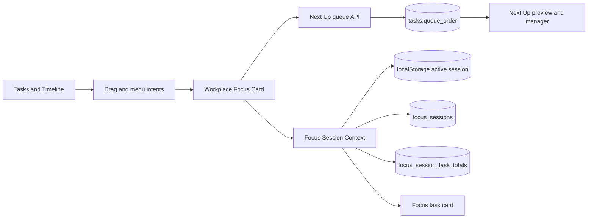

# Focus Next Up — Living Design Specification

**Status:** Living specification — **Shipped** (Next Up V2 on production). Refine only under hold; do not reopen V1 queue plan.  
**Last updated:** July 21, 2026 (status pass)  
**Owner:** FlowOS Product  
**Primary surface:** Today → Workplace → Quick Focus / Queue  
**Authoritative decisions:** [Decision log](../../execution/logs/decision-log.md) wins if this document conflicts with it.

---

## 1. Executive summary

**Next Up** is FlowOS’s durable, task-only execution queue: a short, intentionally ordered answer to:

> “After the work I am doing now, what have I already decided to do next?”

It is not a second task list, a schedule, a habit tracker, or an automation engine. Tasks remain the inventory of work. The Timeline remains the plan for time. Focus remains the active work state. Next Up connects these layers without forcing the user to reorganize their day or accept an automatic context switch.

The feature exists on Today’s Quick Focus surface because execution decisions belong beside the timer, not in a separate planning page. A user can:

1. drag an eligible task into Next Up to preserve an execution intention;
2. place it deliberately in queue order;
3. start it explicitly when ready;
4. see exactly what is next without losing the current timer; and
5. return to task details or complete work without creating a second workflow.

The queue persists independently from a focus session. Focus-session task totals are separate: they accurately show how much of the active session has been spent on a particular task, even if the user changes task targets.

---

## 2. Why FlowOS needs Next Up

### The productivity problem it solves

Without Next Up, FlowOS has three useful but incomplete layers:

| Layer | Question answered | Limitation on its own |
|---|---|---|
| Tasks | What work exists? | A task inventory does not decide what follows current work. |
| Timeline | What was planned for a time? | A schedule may be stale, interrupted, or too broad to dictate execution. |
| Focus | What am I doing right now? | A timer has no durable, user-chosen “after this” list. |

This leaves a recurring execution gap: after stopping, completing, or switching work, the user must rediscover intent in a long task list or schedule. That creates decision fatigue exactly when FlowOS should reduce it.

### Product impact if Next Up does not exist

Without Next Up:

- planning and execution collapse into the same task list;
- the user re-evaluates the next task after every interruption;
- a timeline block can feel like a command rather than a suggestion;
- switching focus risks losing the intended sequence;
- Today has more visible work but less actionable direction;
- focus sessions remain isolated timer events instead of part of a continuous day.

The result conflicts with FlowOS’s core principles: execution before planning, one obvious next action, reduced context switching, and open-to-action in under five seconds.

### Product impact when it works

When Next Up works well:

- a user can decide a small sequence once and execute it with less re-planning;
- a user can preserve important work even when the timeline changes;
- the focus timer stays the hero while the next decision remains nearby;
- tasks, focus, and reflection form a clearer plan → execute → reflect loop;
- FlowOS becomes a continuous daily system rather than a collection of pages.

This feature is valuable only if it reduces thinking and context switches. It must never become another place to manage the entire day.

---

## 3. Product position and mental model

### The intended model

```text
Tasks / Timeline              Next Up                    Focus
What exists / was planned  →  What I chose next     →   What I am doing now
```

| Concept | User mental model | Persistence |
|---|---|---|
| Task | A unit of work that exists. | Durable task record |
| Timeline block | A plan for when work might happen. | Durable scheduling data |
| Next Up item | A deliberate execution intention for later. | Durable queue order on the task |
| Focus target | The work attached to the active timer. | Active session state |
| Focused time | Time actually spent focusing on one task in a session. | Durable task-session total plus active-session state |

### The key distinction

**Next Up is future-facing. Focus is present-facing.**

The current focus task is not shown as a future queue item. Starting a queued task removes it from Next Up because it has moved from “later” to “now.” If the user wants to defer it again, they can intentionally requeue it.

### Vocabulary

Use these names consistently:

| Use | Preferred term | Avoid |
|---|---|---|
| Queue | Next Up | “Current queue,” “task stack,” “playlist” |
| Active task panel | Focus task | “Current Focus” when it means the task |
| Active quick state | Focusing, Paused, On break | Ambiguous “active” alone |
| Action | Start focus | “Activate” in user-facing UI |
| Queue item 1 | Next | “Current” |
| Duration spent on a task | Focused | “Elapsed” when it is task-specific |

---

## 4. Scope, non-goals, and status

### In scope

- An ordered queue of incomplete tasks scheduled for Today or unscheduled.
- Persistent order on `tasks.queue_order`.
- Add, insert, reorder, remove, complete, open details, and explicitly start focus.
- Three-item, non-scrolling preview and an expanded queue manager.
- Drag sources from task and timeline surfaces.
- Explicit distinction between adding to Next Up and starting focus.
- Task-specific focus attribution during Quick Focus.
- Focus state clarity: Focusing, Paused, On break.

### Explicitly out of scope

- Habits in Next Up.
- A localStorage-only or session-scoped queue.
- Queue-specific scheduled-task takeover, auto-start, or mandatory prompts.
- A separate Next Up route, sidebar item, page, or task manager.
- Automatic requeueing after a task returns to Today.
- Pomodoro queue behavior changes.
- Calendar sync, AI recommendation, priority scoring, or automatic queue ordering.
- A queue history, queue analytics surface, or “smart” backlog.

### Current delivery status

| Area | Design status | Current implementation status |
|---|---|---|
| Persistent queue model | Decided | Implemented in code; requires `tasks_next_up_queue.sql` in the target database |
| Task-only eligibility | Decided | Implemented |
| Preview, queue manager, reorder | Decided | Implemented in the Workplace Focus path |
| Positional external drops | Decided | Implemented in the Workplace Focus path |
| Explicit Start focus drop target | Decided | Implemented for Focus-card drag flow |
| Per-task session focus totals | Decided | Implemented in code; requires `focus_session_task_totals.sql` in the target database |
| Cross-surface start confirmation | Required consistency | Needs consolidation behind one shared start-request path |
| Real-user validation | Required before declaring shipped | Pending founder dogfooding |

Database migration state is recorded in [`supabase/APPLIED_STATE.md`](../../../supabase/APPLIED_STATE.md). A code path is not considered production-ready until its migration and RLS verification are complete.

---

## 5. User jobs and success criteria

### Primary jobs

1. **Protect an execution decision:** “I know what I want to do after this; do not make me rediscover it.”
2. **Start deliberately:** “I want to work on this task now, without accidentally losing the task I am currently doing.”
3. **Change sequence quickly:** “This should happen before that; let me place it where it belongs.”
4. **Continue through interruptions:** “I paused or took a break; retain my task context and focused time.”
5. **Keep planning separate from doing:** “My schedule informs me, but it does not hijack my current work.”

### Success criteria

The feature is successful when a founder can:

- build a small execution sequence without leaving Today;
- understand the first queue item at a glance;
- tell whether a task will queue or start before releasing a drag;
- start a task without ambiguity about what happens to current focus;
- recover after refresh, pause, break, or a task completion;
- complete the plan → focus → reflection loop with fewer task-list visits.

### Signals to observe during dogfooding

| Signal | Why it matters |
|---|---|
| Queue additions per focused day | Indicates whether the feature earns a real execution role. |
| Queue start rate | Distinguishes useful intention from abandoned backlog. |
| Reorder rate | High rate may mean default order or timing information is insufficient. |
| Immediate start vs queue drop ratio | Tests whether both drop destinations are understandable. |
| Task switches per session | Detects thrashing or legitimate flexible work. |
| Focused time attributed to switched tasks | Validates trust in the focus tracker. |
| Manual notes about confusion | More important than optimizing an unvalidated metric. |

Do not use these metrics to justify adding automation before real behavior supports it.

---

## 6. Eligibility and lifecycle

### Eligibility

A task can enter Next Up only when all conditions are true:

```text
not completed
AND planning_state is not "later"
AND scheduled_date is Today OR null
```

This makes Next Up a Today execution layer, not a hidden global backlog.

### Queue lifecycle

| Event | Queue result | Focus result |
|---|---|---|
| Add from task/timeline source | Add at selected insertion point or end | Unchanged |
| Drop on empty/untargeted Next Up zone | Append | Unchanged |
| Drop between rows | Insert before indicated row; normalize order | Unchanged |
| Drag an existing queue row | Reorder; normalize order | Unchanged |
| Start queued task | Remove from queue | Start new Quick Focus or change focus target |
| Complete queued task | Remove through completion lifecycle | Unchanged unless it is current focus |
| Complete current focus task | Remove through completion lifecycle | Clear focus target; queue head remains ready, not auto-started |
| Move task to Tomorrow, another date, or Later | Remove immediately | If currently focused, task handling must remain explicit rather than silently retarget |
| Return a task to Today | Do not auto-requeue | Unchanged |
| Remove from queue | Set `queue_order` to `null` | Unchanged |
| Stop a focus session | Queue remains | Session state ends; task-specific totals persist |

### Ordering rule

`queue_order` is the only authoritative queue order. It is a positive integer, normalized to `1..N` after insert or reorder. No priority, scheduled time, or AI score may silently reorder it.

---

## 7. Interaction contract and collision rules

### Drag destinations

When an eligible task is dragged over the Quick Focus card, show two explicit destinations:

| Destination | Visual treatment | Release result |
|---|---|---|
| **Add to Next Up** | Largest blue feedback target; positional insert line when applicable | Queue task; leave timer and current target untouched |
| **Start focus** | Secondary, clearly labelled target | Request immediate focus on task |

The destinations exist to make two different intentions visible. A generic drop on a focus surface must never guess whether the user meant “later” or “now.”

### Immediate-start collision matrix

| Current Quick Focus state | User starts task B | Required behavior |
|---|---|---|
| Idle | Start task B | Create targeted Quick Focus session |
| Focusing task A | Start task B | Confirm: **Keep current** or **Switch focus** |
| Paused on task A | Start task B | Set B as the next focus target; do not resume timer |
| On break after task A | Start task B | Set B as target after break; do not end break |
| No task target | Start task B | Attach B to the running session |
| Pomodoro active | Start task B | Do not create a parallel Quick Focus session; explain/disable according to the existing mutual-exclusion rule |

The confirmation is needed only when an actively focusing task would be replaced. A deliberate focus-start control is already an explicit action, but the user still deserves a final chance to retain in-progress context.

### Task and timeline source collisions

| Trigger | Next Up behavior | Why |
|---|---|---|
| Task card drag | Eligible task can queue or start via explicit destination | Supports direct execution from inventory |
| Timeline task drag | Eligible task can queue or start via explicit destination | Timeline informs intent but does not take over |
| Task details “Add to Queue” | Append by default | Details is not a spatial ordering surface |
| Task context-menu “Start focus” | Use the same start-request logic as the Focus card | Prevent inconsistent switch semantics |
| Timeline’s scheduled-now selection | Do not override a manually selected task or non-empty Next Up queue | User-controlled execution wins |
| Habit drag | Reject with clear task-only message | Keeps Next Up’s mental model small |
| Duplicate drag | No-op | Avoid duplicate execution commitments |

### Queue and scheduling collisions

- Scheduled time is **context**, not a command. Display it on a queue row when known.
- A task’s scheduled time and duration render like Today:
  - duration only → `25m`;
  - time only → `6:30 pm`;
  - time + duration → `6:30 pm – 7:00 pm`.
- A scheduled task must not auto-enter, auto-start, or displace the queue.
- Timeline auto-selection pauses while an explicit queue exists; a user-built sequence must not be overwritten every 30 seconds.

### Completion collision

Completing the current focus task is an execution event, not permission to begin the next one automatically. Clear the current target and leave queue item 1 visibly available as **Next**. This preserves user control after a completion, interruption, or unexpected change of plan.

---

## 8. Focused-time attribution

### Why session-wide time is wrong

A focus session can contain multiple task targets. Displaying the session’s total focus time on whichever task is currently active attributes work incorrectly after a switch. This erodes trust precisely when FlowOS claims to help users reflect on what they did.

### Task-focused-time rule

`Focused` on the Focus task card means:

> The accumulated Quick Focus time spent on this task in the active session.

It does **not** include:

- focus time spent on another task in the same session;
- pause time;
- break time;
- planned duration;
- wall-clock time since the session started.

### Runtime algorithm

```text
On a task focus segment:
  begin task_focus_started_at

On pause, break, target switch, or stop:
  add elapsed focused seconds to task_focus_totals[currentTask]
  clear task_focus_started_at

On resume focus:
  start a new segment for the current task

When rendering:
  focused(task) = finalized total + live active-focus segment
```

### Persistence model

| Store | Responsibility |
|---|---|
| `flowos.focus.active` localStorage | Active timer, current target, task totals, current segment start; supports refresh and cross-tab session continuity |
| `focus_sessions` | Aggregate completed/stopped focus session history |
| `focus_session_task_totals` | Durable task-specific totals keyed by user, active-session UUID, and task ID |

Task totals are upserted at durable transition boundaries. A temporary network failure must not interrupt a timer or prevent a task switch; local active-session state remains the immediate source of truth.

### Focus state vocabulary

| State | Timer behavior | Task-focused time |
|---|---|---|
| Focusing | Timer advances | Advances for target task |
| Paused | Timer frozen | Frozen |
| On break | Break timer advances | Frozen |
| Paused on break | Timer frozen | Frozen |
| Idle | No session | No live value |

---

## 9. UI and UX specification

### 9.1 Quick Focus hierarchy

The timer remains the visual hero. Next Up must help the next decision without competing with the current one.

```text
┌────────────────────────────────────────────────────────┐
│ Focus / Pomodoro                         Focus Reflection│
│ Today’s focus · Today’s break                         time│
│                                                        │
│                    [ timer ]                           │
│              Focusing · Pause · Break · Stop           │
│                                                        │
│ Focus task                                              │
│ Draft product spec                         [details] […]│
│ Focusing · Inbox                                      │
│ Focused 18m 20s        Target 25m                      │
│                                                        │
│ Next Up (3)                                             │
│ ● Review pull request                        Next 25m   │
│ ○ Prepare notes                         6:30–7:00 pm    │
│ ○ Email Sam                                       10m    │
│                                                        │
│ View all (2 more) →                                    │
└────────────────────────────────────────────────────────┘
```

### 9.2 Focus task card

The card is a compact status strip, not a giant task-detail link.

**Show**

- `Focus task` label;
- task title;
- explicit status badge;
- group and priority context where space permits;
- `Focused` time for the current task;
- `Target` duration or `—`;
- icon-only task-details action;
- explicit complete / skip actions in an intentional actions menu.

**Do not show**

- started time;
- remaining time;
- a redundant “Open Task” text link;
- pinned descriptions;
- a whole-card click that unexpectedly opens task details;
- queue-removal controls when the task is no longer in the queue.

### 9.3 Collapsed Next Up preview

| Rule | Behavior |
|---|---|
| Capacity | At most three rows; never internally scroll |
| First row | Mark as **Next** |
| Empty state | Large, task-only drop target with clear copy |
| Time | Use existing Today task timing convention |
| Overflow | `View all (N more)` opens the queue manager |
| Current task | Exclude from display because it has moved from future to present |
| Accessibility | Header and overflow are keyboard reachable; visible labels describe the action |

### 9.4 Expanded queue manager

On desktop, the Focus card expands into a right-side in-card queue pane while the timer remains visible. On mobile, use a full-screen sheet. This is a continuation of Focus, not a separate route or a generic modal stack.

The manager contains:

- title and count;
- close action;
- current focus context;
- independently scrolling queue list;
- visible complete, details, start-focus, and remove controls;
- drag handle and keyboard reorder;
- insertion lines during reorder and external drops;
- an explicit end-of-list drop zone.

### 9.5 Drag feedback

Feedback must answer “what happens if I release now?”:

- blue active feedback for **Add to Next Up**;
- a visible line before the exact insertion row;
- an end line when the task will append;
- a separately styled **Start focus** destination;
- warning treatment for a habit or another ineligible source;
- no hidden behavior based only on hover.

### 9.6 Accessibility and resilience

- Critical actions remain visible without hover.
- Buttons have specific accessible labels, e.g. `Start focus on “Review PR”`.
- Keyboard users can move queue items with the documented shortcut and operate all row controls.
- The expanded manager closes with `Escape`.
- Focus timer must not move or restart when the queue scrolls or opens.
- Respect reduced motion for pane transitions and drag feedback.
- Error feedback must explain the failed action without hiding the existing queue.

---

## 10. System architecture



### Responsibilities by layer

| Layer | Responsibility | Must not own |
|---|---|---|
| `task-next-up.ts` | Eligibility, fetch, insert, remove, persistent order | Timer state or UI state |
| `task-next-up-logic.ts` | Pure queue ordering and display helpers | Supabase calls |
| `workplace-focus-card.tsx` | Focus UI orchestration, drag destinations, local interaction state | Duplicated persistence rules |
| `next-up-preview.tsx` | Compact scan and positional external drop affordance | Full queue management |
| `next-up-drawer.tsx` / queue list | Expanded manager and reorder affordance | Focus-session persistence |
| `focus-session-context.tsx` | Active quick/pomodoro lifecycle and focus-target change | Queue ordering |
| `focus-active-session.ts` | Pure active-session state transitions and task time calculation | UI decisions |
| `focus-task-totals.ts` | Persist task-specific session totals | User interface |
| Workplace focus-target context | Schedule/manual active target selection | Replacing explicit queue intent |

### Data model

| Data | Source | Meaning |
|---|---|---|
| `tasks.queue_order` | `tasks_next_up_queue.sql` | Durable positive order for a queued task; `null` means not queued |
| Task planning fields | `tasks` | Eligibility and display context: completion, plan state, date, time, duration |
| Active focus target | Stored active focus session | Task/habit currently attached to Quick Focus |
| `task_focus_session_id` | Stored active focus session | Stable client UUID that groups task totals for one active session |
| `task_focus_totals` | Stored active focus session | Finalized seconds per task during a live session |
| `focus_session_task_totals` | SQL table with RLS | Durable task-focused totals for the active-session UUID |

### Security model

- All queue queries and mutations are user-scoped.
- Queue order RPC updates only rows owned by `auth.uid()`.
- `focus_session_task_totals` has RLS for select, insert, and update by `user_id`.
- No user data table may use `using (true)`.
- New migration application requires an updated applied-state record and two-account RLS verification.

---

## 11. Direct and indirect integrations

### Directly involved features

| Feature | Relationship |
|---|---|
| Today / Workplace | Primary execution surface and source of truth for this UI |
| Tasks board | Task inventory, drag source, task details, completion lifecycle |
| Timeline | Scheduled context and drag source |
| Quick Focus | Current target, timer controls, state, and task-focused time |
| Focus session history | Aggregate session persistence |
| Task detail panel | Read/edit source of task metadata; queue entry point |
| Schedule Break | Pauses task focus attribution while preserving current task context |
| Reflection | Receives completed focus-session context after stop |

### Indirectly involved features

| Feature | Relationship |
|---|---|
| Task planning state | Determines whether a task remains eligible |
| Manual task order | Separate from queue order; neither must overwrite the other |
| Notifications | Existing break notifications coexist; Next Up introduces no automatic schedule notification |
| Focus history / heatmap | May later consume task totals, but must not dictate queue behavior |
| Cross-tab sync | Active focus session syncs through localStorage; durable queue uses Supabase |
| App shell / navigation | No new nav item; Next Up stays embedded in Focus |

---

## 12. Failure modes, recovery, and edge cases

| Situation | Required recovery |
|---|---|
| Queue is empty | Show a clear task-only empty state; do not show fake suggestions |
| Task is already queued | No duplicate; retain existing position |
| Task becomes completed | Remove from queue through normal task lifecycle |
| Task moved to Later or off Today | Remove immediately; do not restore automatically |
| Task is renamed | Refresh row from task source data |
| Task deleted | Remove from rendered queue on next data sync |
| Network failure while queueing | Keep existing queue visible; show failure feedback; do not pretend it succeeded |
| Network failure while focus totals sync | Keep timer and local session working; retry on later transition rather than blocking work |
| Refresh mid-session | Restore active session and task totals from localStorage |
| Second tab changes active session | Resolve through existing storage-event sync; validate behavior during dogfooding |
| Concurrent reorder from multiple devices | Last successful durable order wins; avoid local claims that are not persisted |
| Ineligible habit drag | Reject explicitly; never silently turn it into a task |
| User completes current task | Do not auto-start queue head |
| User changes task during break | Preserve break; selected task becomes the next focus target |

---

## 13. Guardrails: what to maintain and what not to add

### Maintain

- Task-only queue boundary.
- User-owned ordering.
- Persistent execution intent.
- Timer-first hierarchy.
- Explicit start vs queue choice.
- In-place interactions on Today.
- Existing task details as the source for deep task editing.
- Honest, visible focus state.

### Do not add

| Do not add | Why it harms the model |
|---|---|
| Habits in Next Up | Blends recurring routines with a task execution queue and expands mental model |
| Auto-start scheduled tasks | Replaces user control with schedule coercion |
| Automatic priority-based ordering | Makes queue order untrustworthy |
| A picker-heavy “Add item” workflow as primary interaction | Turns execution into task management |
| Queue history/archive | Adds bookkeeping without improving the next decision |
| A new page or nav item | Increases module switching |
| More than three preview rows | Competes with timer and hides the fact that expansion exists |
| Persistent decorative descriptions/pins in Focus | Makes execution surface read like task detail |
| Multiple definitions of “current” | Breaks trust between queue and focus state |

### Future ideas that require evidence, not enthusiasm

- A lightweight manual add picker if real users cannot reliably drag from existing task surfaces.
- Task-focused-time history in Task Details.
- Queue suggestions based on repeated founder behavior.
- Better cross-device conflict handling.
- Mobile drag affordances validated with actual users.

None of these should be built without evidence that the current small model fails.

---

## 14. Quality bar and verification

### Functional acceptance

1. Eligible Today and unscheduled tasks can be queued; habits cannot.
2. Queue order persists after refresh and is independent of focus-session stop.
3. External drop inserts before the indicated row or appends at the end.
4. Duplicate queue attempts do not create duplicate rows.
5. Starting from Next Up removes the task from future queue and targets it for focus.
6. Replacing an actively focused task requires a clear user decision.
7. Paused/break state does not silently resume or end when target changes.
8. Completing a current task leaves the queue head ready; it does not auto-start.
9. Task-focused seconds remain correct through A → B → pause → break → A → stop.
10. Focus task UI never opens details through a whole-card click.

### Required automated coverage

- Queue eligibility and lifecycle.
- Insert at first, middle, and end.
- Reorder normalization and duplicate rejection.
- Current-task exclusion.
- Task focus attribution across target switch, pause, break, resume, and stop.
- Drag payload parsing.

### Required manual smoke

- Empty queue, one item, three items, and overflow.
- Drag queue insertion and Start focus destination.
- Start while idle, focusing, paused, and on break.
- Queue manager open/close, independent scroll, keyboard reorder, and mobile sheet.
- Task details, completion, removal, and planning-state changes.
- Refresh and cross-tab active-session recovery.
- Two-account RLS test after every new database migration.

---

## 15. Known improvement and hardening backlog

This is not a feature-expansion list. These items protect the existing design promise:

1. Route every task-source **Start focus** action through one shared confirmation/request flow so it cannot bypass the active-focus collision contract.
2. Add durable retry/backoff observability for failed task-total upserts.
3. Validate external positional drop behavior with pointer, keyboard, and touch input.
4. Verify current-task exclusion cannot produce a reorder index mismatch if a legacy duplicate exists.
5. Apply and verify the Next Up and task-total migrations before production exposure.
6. Replace or remove legacy V1 session-queue helpers only after no imports remain.
7. Capture founder friction evidence before changing preview density, queue automation, or schedule interaction.

---

## 16. Living-document protocol

This document is the design reference for Focus-related specifications and the seed for future FlowOS feature-spec templates.

### When to update it

Update this document in the same change set when any of these change:

- feature purpose or scope;
- a user-visible term;
- queue eligibility, persistence, or lifecycle;
- focus/queue collision behavior;
- data model, migration, or RLS;
- UI hierarchy, responsive behavior, or accessibility;
- direct integration with Tasks, Timeline, Focus, Breaks, or Reflection;
- a newly discovered founder friction.

### Required update sequence

1. Record a material product decision in the decision log.
2. Update this specification’s affected sections and status table.
3. Update implementation mapping and acceptance coverage.
4. Update Feature Inventory when ship status changes.
5. Add empirical evidence or a friction-log link when a user-driven decision changes behavior.

### Specification template lessons

Every future FlowOS feature specification should explicitly include:

- purpose and cost of not building it;
- mental model and vocabulary;
- scope and non-goals;
- trigger/collision matrix;
- state machine and persistence;
- direct and indirect integrations;
- UI hierarchy and responsive/accessibility requirements;
- failure/recovery behavior;
- measurable outcome, verification, and update protocol.

This prevents a polished interface from shipping without a coherent place in the FlowOS daily loop.
