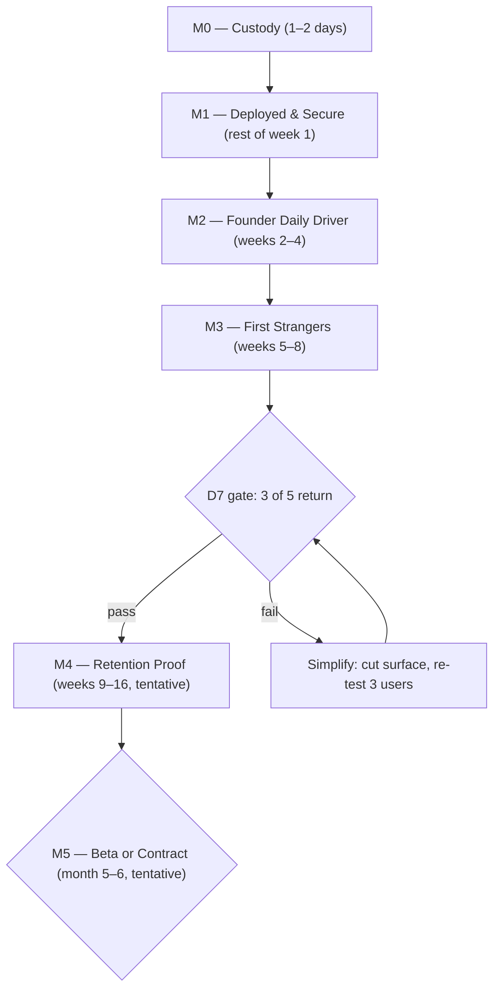

# FlowOS Execution Masterplan

**Date:** July 4, 2026
**Author role:** Founding Engineer / Principal Architect / Staff PM / Startup CTO — strategic advisor to the CEO
**Status:** **Active — supersedes `docs/design/ROADMAP.md` and the `LAUNCH_PLAN.md` timeline as the primary strategic planning document.** (`SUCCESS_METRICS.md` gates and the governance frameworks remain in force; design ROADMAP is retained as historical reference for Phase 0–2.)
**Foundation:** Builds directly on `FOUNDATION_VALIDATION_REPORT.md`. Its conclusions are treated as fact and are not re-argued here.

**Standing rule this document lives under:** The validation report's single recommendation was that FlowOS produce no further internal artifacts until the product is deployed, secured, and used by a stranger. This masterplan is the one deliberate exception — the operating manual that makes that recommendation executable. It is written to be the **last planning document until real-user evidence exists**. Every future document should quote a user or a metric.

---

## How to read this document

- **Milestones, not phases.** Every milestone is a business outcome with an evidence-based exit gate. Nothing advances on calendar time alone.
- **Everything after M3 is tentative by design.** M4 and M5 are sketched so the destination is visible, but their contents will be rewritten from alpha evidence. Planning them in detail today would repeat the exact mistake this plan exists to correct.
- **Durations are budgets, not promises.** They exist to trigger the self-critique rule: if a milestone exceeds its budget by 50%, stop and cut scope — do not extend.

---

## Step 1 — The Destination (12-month outcomes)

What FlowOS should *be* at each horizon. Outcomes only; features are downstream.

| Horizon | Outcome | What is true when it's reached |
|---------|---------|-------------------------------|
| **Week 1** | **Survivable, deployable product** | The company survives a disk failure. The build is green. The database provably isolates users. FlowOS runs on a public URL. |
| **Month 1** | **Founder daily driver** | The founder runs their real life on hosted FlowOS, lands on one coherent home screen, and has a written friction log from lived use — the first non-simulated user research in the project's history. |
| **Month 2** | **First retained strangers** | Five people the founder does not know well have used FlowOS as their daily driver. At least three returned on day 7 without prompting — or FlowOS has a written, evidence-based diagnosis of why not. |
| **Month 4–5** | **Retention proof** | 15 users; D7 > 30% sustained four weeks; the backlog is composed of things users asked for, not things the founder imagined. |
| **Month 6** | **Honest fork in the road** | A written go/simplify decision backed by a retention dossier: either FlowOS earns a closed beta, or it deliberately contracts to its strongest core and re-tests. |
| **Month 9–12 (tentative)** | **Commercial foundation** | 50-user closed beta, onboarding v1, a pricing hypothesis worth testing, D30 data. Not revenue — the *credible option* of revenue. |

**Explicitly not destinations within 12 months:** commercial SaaS at scale, mobile apps, AI features, calendar sync, team features, public launch. These remain governed by the existing stop-list and metric gates.

**The single sentence version:** In 12 months FlowOS should have gone from "a product nobody has used" to "a product a small number of strangers refuse to give up" — and everything in this plan is subordinate to that transition.

---

## Step 2 — The Execution Strategy

### Milestone map

Recruiting for M3 begins **during M2**, not after it — sourcing 5 qualified strangers takes 2–3 weeks of calendar time that must overlap engineering work.

---

### M0 — Custody (1–2 days)

**Purpose:** Make FlowOS survive its own laptop.

**Why it exists:** The validation report's most severe finding: the docs are in no repository, and 4 unpushed commits mean GitHub holds a FlowOS without Workplace or any design phase. Right now, a spilled coffee ends the company. Nothing else in this plan matters if the substrate can vanish.

**Why before M1:** It is measured in hours, requires zero design decisions, and every subsequent milestone commits work that must land somewhere safe.

**Expected learning:** None — this is pure risk removal. (That is fine; not every milestone must teach.)
**Expected user value:** None directly.
**Expected business value:** Existential — converts the company from "one machine" to "recoverable."
**Expected engineering value:** Clean baseline; dead code gone; a deliberate commit closing the drifted working tree.
**Expected design value:** None.

**Success metrics / exit criteria (all required):**
1. `origin/main` contains all local commits.
2. `docs/` is tracked in version control and pushed (either the `flowos/` repo relocated to workspace root, or docs moved into the repo — a 30-minute decision, decided once, recorded in `DECISION_LOG.md`).
3. Dead code deleted: `WorkplaceAgendaCard`, `reflections-mock-store.ts`, `reflections-mock-data.ts`; `workplace-recover-day-bar.tsx` deleted or fixed (decision belongs to M1 build work — deletion is the default).
4. `FlowOS-old/` archived (zipped or pushed to an `archive` branch) and removed from the workspace, with one line in the decision log.

**Dependencies:** None. **Major risks:** None meaningful — the only failure mode is skipping it because it feels trivial.

**Explicitly NOT allowed:** Any refactoring "while we're in there." Any documentation beyond two decision-log lines. Any feature work.

---

### M1 — Deployed & Secure (remainder of week 1)

**Purpose:** A green build, a provably isolated database, and FlowOS on a public URL — founder-only.

**Why it exists:** Three verified facts block everything: the production build fails, the database security state is *indeterminate* (correct policies exist in `auth_migration.sql`; nobody knows what is applied), and `/workplace` is unauthenticated. No user — including the founder on a second device — can touch FlowOS until these close.

**Why before M2:** Building the daily home before the product deploys repeats the pattern the validation report diagnosed: internal progress with no reality contact. Deployment also surfaces environment problems cheapest to fix before feature work sits on top of them.

**Expected learning:** First operational knowledge in the project's history — what deploying FlowOS actually takes, what the live database actually contains.
**Expected user value:** None yet; enables all of it.
**Expected business value:** Converts "MVP" from a claim into a deployable artifact; removes the two catastrophic risks (data custody, data leakage).
**Expected engineering value:** Migration discipline (numbered order, applied-state record), CI enforcing the build, middleware complete.
**Expected design value:** None.

**Success metrics / exit criteria (all required):**
1. `npm run build` passes locally **and in CI on every push** (a minimal GitHub Actions workflow: build + lint. ~1 hour. This mechanizes Product Principle 20 instead of trusting discipline).
2. A written migration runbook: numbered apply order for the 26 SQL files, plus a record of what is applied to the live Supabase project.
3. **The two-account test passes on the hosted instance:** account A cannot read or write account B's tasks, habits, focus sessions, reflections, or habit completions. This is the milestone's defining test.
4. `/workplace` added to `PROTECTED_PREFIXES`; `/goals`, `/ai-coach`, `/weekly-review` return 404 or are verifiably unreachable in production.
5. FlowOS deployed on Vercel; founder can log in and use it from a URL.

**Dependencies:** M0.
**Major risks:** Supabase live-state archaeology takes longer than expected (mitigation: if the existing project is a mess, create a fresh project and apply migrations cleanly — alpha data is disposable *now*, and only now).

**Explicitly NOT allowed:** Any UX change. Any Phase-3-flavored work. Onboarding. Command palette. Writing tests beyond CI build+lint (smoke tests come later, when there's something worth protecting).

---

### M2 — Founder Daily Driver (weeks 2–4)

**Purpose:** One front door. The founder opens FlowOS and is already in their day — then actually lives in it for two weeks.

**Why it exists:** This is the minimum credible version of the product thesis. The validated diagnosis (Dashboard/Workplace split, wrong next-action routing, hover-gated timer, modal-only capture) describes a product that contradicts its own pitch. No stranger should see FlowOS before these four frictions close — first impressions are spent once.

**Why before M3:** Recruiting strangers onto the current IA wastes the one chance at unbiased first-use data; they will churn on problems already known and fixable. Conversely, doing *more* than this before strangers arrive is unvalidated speculation. M2 is scoped to exactly the frictions confirmed by code inspection — no further.

**Expected learning:** The first honest friction log from lived daily use (founder-biased, but real behavior, not simulation). Baseline metrics: open→action time, module switches, loop completions.
**Expected user value:** The core promise becomes true for n=1: open → know what to do → act → reflect, one screen.
**Expected business value:** A demonstrable product. Recruiting can honestly say "this works for me daily."
**Expected engineering value:** Error/loading boundaries; the two monolith files touched only where necessary (no split yet — see self-critique).
**Expected design value:** Navigation cut to 5 items realizes the documented IA hierarchy; no visual work otherwise (design system is frozen).

**Scope (complete list — nothing else ships in M2):**
1. `/` serves Today (Workplace content + inline KPI strip + next-action) — rename user-facing label to **"Today"**.
2. Routing truth: every next-action and scheduled-item link in `dashboard-command.ts` / `schedule.ts` acts **in place** on Today (scroll/highlight/start), never navigates to `/focus`, `/tasks`, `/habits` list pages.
3. Timer controls always visible during an active session; one-click "start focus on this task."
4. Inline capture bar on Today (type → Enter creates task); modal capture becomes secondary.
5. `error.tsx` + `loading.tsx` on the `(main)` route group.
6. Sidebar reduced to 5 items: **Today, Tasks, Habits, Focus (history), Reflection**. Schedule and Notes remain routes, reachable from Today ("Open full timeline") and demoted links. Dashboard nav item removed (`/overview` is **not** built — content lives inline on Today).
7. Founder dogfooding protocol: 10+ consecutive days of real use on the hosted instance, with a dated friction log.

**Success metrics / exit criteria:**
- Founder lands on execution surface with zero clicks; open → first meaningful action < 5s self-timed.
- Every next-action click keeps the founder on Today (verified across task/habit/focus/reflection states).
- Full loop (plan → focus ≥ 1 session → reflect) completed by the founder ≥ 5 days in one week, hosted.
- ≥ 3 alpha candidates in the recruiting pipeline (started in parallel — see M3).

**Dependencies:** M1 (deployed, secure, CI green).
**Major risks:** (a) Scope creep into "Phase 3 by another name" — mitigated by the closed scope list above and the NOT-allowed list; (b) the two 2.5k-line monoliths (`tasks-board-view.tsx`, `timeline-planner.tsx`) make routing/home changes riskier — mitigated by keeping changes at the page-composition and lib-function level wherever possible; (c) founder judges own product too kindly — mitigated by the requirement for a *dated, written* friction log, not impressions.

**Explicitly NOT allowed:** Command palette. Keyboard OS. Planning-model changes. Reflection save unification. Schedule/Notes feature work. Any new module. Monolith refactors. Visual polish. Writing any document other than the friction log and decision-log entries.

---

### M3 — First Strangers (weeks 5–8)

**Purpose:** Put FlowOS in the hands of 5 qualified strangers and measure whether they come back.

**Why it exists:** This is the milestone the entire company has been avoiding for a month, and the only one that can falsify the founding bet (integration beats best-of-breed enough to switch daily drivers). Everything before it is preparation; everything after it is response.

**Why before M4:** M4's contents are unknowable until M3 produces evidence. Any pre-M3 investment beyond M2's scope has negative expected value: it either duplicates what users would have asked for or builds what they wouldn't.

**Expected learning:** The most valuable in the company's history: Do strangers return? Where do they stall in the first 10 minutes? What do they use outside FlowOS because FlowOS failed? Does the desktop-web-only, no-calendar constraint disqualify the product (the validation report's hidden assumption #2 and #3 get their first real test)?
**Expected user value:** Five people get a founder-supported daily productivity tool and direct influence over it.
**Expected business value:** D1/D7/WAD data — the first numbers that mean anything; testimonial and case-study raw material if it works.
**Expected engineering value:** Real-world bug discovery (multi-device localStorage divergence will likely surface here — see self-critique); a weekly fix cadence habit.
**Expected design value:** Observed (not simulated) first-run behavior; the raw material for onboarding later.

**Success metrics / exit criteria:**
- 5 users onboarded per the `USER_PERSONAS.md` criteria (knowledge workers who already use 2+ productivity apps; **not** developer friends, per the anti-persona rules).
- Every user: day-0 onboarding call (watch first 10 minutes), day-3 async check-in, day-7 interview (the five standard questions from `SUCCESS_METRICS.md`), day-14 retrospective.
- **The gate: ≥ 3 of 5 return on day 7 unprompted** (per `ALPHA_SUCCESS_CRITERIA.md`, which remains authoritative).
- Exit is either **gate passed** or **a written failure diagnosis** naming the top 3 evidenced causes. Both outcomes complete the milestone. Recruiting more users to dilute bad data does not.

**Dependencies:** M2 complete; pipeline of ≥ 5 candidates (built during M2); zero P0 security incidents.
**Major risks:** (a) Recruiting stalls — mitigated by starting outreach in week 2 and accepting a 4-user wave over a 2-week delay; (b) ambiguous middle results (2/5) — pre-committed response: treat as fail, diagnose, fix, re-test with 2 fresh users; (c) the founder reacts to feedback by building instead of listening — mitigated by the one-fix-per-week rule below.

**Rules of engagement during M3:** Ship at most **one friction fix per week**, chosen from the top of the user-evidence log. Nothing speculative. Every fix gets verified with the user who reported it.

**Explicitly NOT allowed:** New features users didn't ask for. Public launch activity of any kind. Recruiting beyond 5. Reacting to any single user's feature request (3+ users citing it as a churn risk is the bar, per `PRODUCT_DECISION_FRAMEWORK.md`).

---

### M4 — Retention Proof (weeks 9–16, tentative)

**Purpose:** Convert "3 of 5 came back" into "retention holds at 15 users," with a backlog composed entirely of pulled (user-evidenced) work.

**Why it exists:** 5 users is a signal, not proof. The Wave 2 gate (D7 > 30% sustained 4 weeks at 15 users) is the threshold at which FlowOS stops being an experiment.

**Why after M3:** Its contents are deliberately unwritten. The standing candidate list — command palette, reflection save unification, planning simplification, habit-completion persistence fix, smoke tests on critical paths — enters the milestone **only when user evidence pulls it**. The one exception: **smoke tests (auth, task CRUD, focus session, reflection save) become mandatory at the start of M4** regardless of user demand, because 15 users is the point where a regression costs real trust.

**Expected learning:** Which frictions are systemic vs idiosyncratic; whether the wedge hypothesis ("tired of four apps") matches the actual reason retained users stay.
**Expected user/business value:** A retained cohort; the beginning of word-of-mouth; the evidence base for every future decision.
**Expected engineering value:** First automated safety net; hybrid-persistence cleanup (near-certain to be pulled by multi-device bugs).
**Expected design value:** First evidence-based UX iteration in the product's history.

**Exit criteria:** D7 > 30% sustained 4 weeks at 15 users; D14 > 20%; external-tool fallback decreasing week over week. Or: a second gate failure, triggering the simplification path (cut to Today + Tasks + Reflection, re-test with 3 fresh users — per `ALPHA_SUCCESS_CRITERIA.md` pivot rule).

**Explicitly NOT allowed:** Goals, AI, gamification, calendar, mobile (unchanged stop-list); onboarding automation (manual onboarding is a feature at this scale — it is the research method); any work item without a named user behind it except the smoke-test package.

---

### M5 — Beta or Contract (month 5–6, tentative)

**Purpose:** A written, evidence-backed decision: FlowOS either earns a 50-user closed beta or deliberately contracts to its strongest core.

**Why it exists:** The validation report identified "reverting to artifact production when results are ambiguous" as the founder's most likely failure mode. M5 forces a binary, dated decision with a dossier behind it, so ambiguity cannot quietly become drift.

**Contents (sketch only):** Retention dossier (all cohort data, interview synthesis, churn reasons); decision memo in `DECISION_LOG.md`; if GO — closed-beta prerequisites become the next masterplan revision (onboarding v1, privacy policy draft, Phase 5 QA subset, backup strategy); if CONTRACT — the simplification experiment becomes it.

**Exit criteria:** The decision is written, dated, and acted on within one week of writing.

---

## Step 3 — Disposition of the Existing Roadmap

Every currently planned phase, judged against this strategy:

| Existing item | Verdict | Reasoning |
|---|---|---|
| **Security week** (CEO review / governance pass) | **Keep, split into M0+M1** | Correct and non-negotiable. Split because custody (M0) is a distinct, even-more-urgent concern the old plan missed entirely. |
| **Phase 3.1 — Gravitational Center** | **Merge into M2, trimmed** | The core (Today as home, routing truth, visible timer, inline capture) survives intact. Trimmed: "Dashboard becomes optional Overview" — no `/overview` page gets built; KPIs go inline on Today. Building a page nobody asked for to soften a demotion is scope. |
| **Phase 3.2 — Command Layer** | **Modify: demote to conditional, move to M4** | The 2026-table-stakes argument is a power-user simulation, not evidence. With 5 nav items and in-place next-action, the hunt problem may shrink below palette-priority. Build it the week ≥ 2 alpha users ask "how do I find X" — not before. Inline capture (the other half of 3.2) is already in M2. |
| **Phase 3.3 — Focus Without Friction** | **Split** | Always-visible timer + one-click start: **into M2** (verified frictions, cheap). `/focus` page reframe and sidebar pinning: **M4, pulled by evidence**. |
| **Phase 3.4 — Planning Simplification** | **Move later (M4, conditional)** | The planning-model diagnosis is plausible but unobserved. Which of the three scheduling surfaces users actually gravitate to is exactly what alpha reveals. Deciding the "default" before watching five users plan is guessing. |
| **Phase 3.5 — Day Arc** | **Move later (M4/M5, conditional)** | Morning strip and evening nudge are retention polish. Reflection-save unification within it may get pulled earlier if users hit the dual-save confusion. |
| **Phase 3.6 — Keyboard OS** | **Delete from pre-beta scope** | j/k navigation for a product with zero retained users is the definition of premature. Revisit at closed beta if power users materialize. |
| **Phase 4 — Signature Moments** | **Postpone past M4 unchanged** | Already correctly gated by the docs ("do not ship Phase 4 before Phase 3 validated"). This plan keeps that. |
| **Phase 5 — QA & Audit Gates** | **Split** | Contrast/keyboard spot-check: pre-beta (M5 GO path). Full WCAG + screenshot regression: production gate. Unchanged in substance, re-homed to milestones. |
| **LAUNCH_PLAN.md timeline** | **Supersede** | Its stages and gates were sound; its calendar and its "Phase 3.2 strongly recommended before Wave 1" are replaced by this document. |
| **ALPHA/BETA_SUCCESS_CRITERIA, RELEASE_CRITERIA, SUCCESS_METRICS** | **Keep as-is** | The gates are good. This plan re-sequences work; it does not re-litigate thresholds. |
| **dnd-kit migration (engineering track)** | **Keep deferred, indefinitely** | Works today; zero user value; regression risk on the most complex surface. |
| **Monolith splits (`tasks-board-view`, `timeline-planner`)** | **Keep deferred, with a tripwire** | Do not split proactively. Tripwire: the second time an M2–M4 change in either file causes a regression or a >1-day slowdown, split the file then, as pulled work. |

**Net effect:** The old plan's 12 committed pre-alpha weeks (3.1–3.6) become ~3 committed weeks (M2) plus a conditional, evidence-pulled pool. Alpha moves from "after Phase 3.2" to "after M2" — roughly 4–6 weeks sooner.

---

## Step 4 — Milestone Decomposition

Structure: Milestone → Project → Epic → Work Package (WP). Effort assumes one founder-engineer, focused days. No implementation tasks here — structure only.

### M0 — Custody

**Project: Repository Integrity**

**Epic 0-A: Version control unification**

| WP | Purpose / Scope | Impact | Effort | Deps | Deliverables | Risks |
|----|-----------------|--------|--------|------|--------------|-------|
| **WP-0.1 Push & unify** | Push 4 local commits; bring `docs/` under the repo (relocate repo root or move docs in); commit the drifted working tree deliberately (keep the one substantive diff or revert it consciously) | Existential | 0.5 d | — | `origin/main` current; docs tracked & pushed; clean status | Line-ending noise pollutes the commit — normalize `.gitattributes` in the same pass |
| **WP-0.2 Dead code removal** | Delete `WorkplaceAgendaCard`, `reflections-mock-store.ts`, `reflections-mock-data.ts`; default-delete `workplace-recover-day-bar.tsx` | Build health, trust | 0.25 d | WP-0.1 | Deletion commit | Recover-day logic wanted later — it's in git history; delete anyway |
| **WP-0.3 FlowOS-old disposition** | Archive and remove `FlowOS-old/`; one decision-log line | Clarity | 0.25 d | — | Archive + log entry | None |

### M1 — Deployed & Secure

**Project: Ship Gate**

**Epic 1-A: Build health**

| WP | Purpose / Scope | Impact | Effort | Deps | Deliverables | Risks |
|----|-----------------|--------|--------|------|--------------|-------|
| **WP-1.1 Green build** | `npm run build` passes after WP-0.2 deletions; fix any residual type errors | Unblocks deploy | 0.25 d | WP-0.2 | Green local build | Hidden secondary errors behind the first — budget says fix, not investigate |
| **WP-1.2 Minimal CI** | GitHub Actions: build + lint on every push to main | Mechanizes discipline | 0.25 d | WP-1.1 | Passing workflow | None |

**Epic 1-B: Data security**

| WP | Purpose / Scope | Impact | Effort | Deps | Deliverables | Risks |
|----|-----------------|--------|--------|------|--------------|-------|
| **WP-1.3 Migration runbook** | Number the 26 SQL files into a documented apply order; record live-project applied state | Ends security indeterminacy | 0.5 d | — | Runbook + state record (committed) | Live project archaeology; fallback = fresh Supabase project |
| **WP-1.4 RLS verification** | Apply `auth_migration.sql` (and any missing migrations) to the live project; run the two-account isolation test on every core table | **Highest-stakes WP in the plan** | 0.5–1 d | WP-1.3 | Passing two-account test, results recorded | Legacy rows without `user_id`; policy interactions — test every table, not a sample |
| **WP-1.5 Middleware completion** | `/workplace` protected; `/goals`, `/ai-coach`, `/weekly-review` unreachable in prod | Closes auth gap | 0.25 d | — | Updated `middleware.ts` | Next 16 middleware→proxy deprecation — do not migrate now, just note it |

**Epic 1-C: First deployment**

| WP | Purpose / Scope | Impact | Effort | Deps | Deliverables | Risks |
|----|-----------------|--------|--------|------|--------------|-------|
| **WP-1.6 Vercel deploy + runbook** | Deploy; env vars documented; founder logs in from the URL; redeploy-from-scratch steps written (one page) | First operational reality | 0.5 d | WP-1.1, 1.4, 1.5 | Live URL + runbook page | First-deploy unknowns; that's the point |

### M2 — Founder Daily Driver

**Project: One Front Door**

**Epic 2-A: Today as home**

| WP | Purpose / Scope | Impact | Effort | Deps | Deliverables | Risks |
|----|-----------------|--------|--------|------|--------------|-------|
| **WP-2.1 Home merge** | `/` renders Today (Workplace content + inline KPI strip + next-action card); label "Today"; `/workplace` redirects to `/` | Friction #1 dead | 2–3 d | M1 | Unified home | Workplace page composition complexity; keep changes at page/lib level |
| **WP-2.2 Routing truth** | All `dashboard-command.ts` / `schedule.ts` hrefs become in-place actions on Today (scroll, highlight, start timer) | Friction #2 dead; trust restored | 1.5–2 d | WP-2.1 | No next-action click leaves Today | Edge states (empty day, all-done, active session) — enumerate and test each by hand |
| **WP-2.3 Nav reduction** | Sidebar to 5 items; Schedule/Notes demoted to secondary access; Dashboard item removed | IA hierarchy real | 0.5 d | WP-2.1 | 5-item nav | Founder attachment to modules — the decision is already made in three documents |

**Epic 2-B: Loop mechanics**

| WP | Purpose / Scope | Impact | Effort | Deps | Deliverables | Risks |
|----|-----------------|--------|--------|------|--------------|-------|
| **WP-2.4 Visible focus controls** | Remove hover gate during active sessions; one-click start-focus from a task row / next-action | Friction #8/#9 dead | 1 d | WP-2.1 | Always-visible timer controls | `workplace-focus-card.tsx` is 32KB — surgical change only |
| **WP-2.5 Inline capture** | Capture bar on Today: type → Enter creates task; modal demoted to secondary | Friction #7 dead | 1–1.5 d | WP-2.1 | Working capture bar | Scope temptation (prefixes for notes/habits) — tasks only in M2 |

**Epic 2-C: Reliability floor**

| WP | Purpose / Scope | Impact | Effort | Deps | Deliverables | Risks |
|----|-----------------|--------|--------|------|--------------|-------|
| **WP-2.6 Error/loading boundaries** | `error.tsx` + `loading.tsx` on `(main)` route group | Alpha trust when Supabase hiccups | 0.5 d | — | Boundaries shipped | None |

**Project: Reality Contact (parallel, non-engineering)**

| WP | Purpose / Scope | Impact | Effort | Deps | Deliverables | Risks |
|----|-----------------|--------|--------|------|--------------|-------|
| **WP-2.7 Dogfooding protocol** | 10+ consecutive days of real hosted use; dated friction log; baseline metrics (open→action, switches, loop completions) | First real user research | 15 min/day | WP-2.1+ | Friction log + baselines | Self-kindness bias — log format forces specifics (what, when, cost) |
| **WP-2.8 Recruiting pipeline** | Build a 15-name candidate list against persona criteria; begin outreach week 2; secure 5 commitments; draft onboarding call script + feedback template | M3 cannot start without it | 2–4 h/wk | — | 5 committed users, script, template | **Most commonly underestimated WP in solo plans** — calendar time, not effort time; start immediately |

### M3 — First Strangers

**Project: Alpha Wave 1**

| WP | Purpose / Scope | Impact | Effort | Deps | Deliverables | Risks |
|----|-----------------|--------|--------|------|--------------|-------|
| **WP-3.1 Onboarding operations** | 5 × day-0 calls (watch first 10 min); day-3 check-ins; day-7 interviews; day-14 retros | The research method itself | ~2 h/user/wk | WP-2.8, M2 exit | Filled feedback docs per user | Founder defensiveness on calls — script includes "say nothing for the first 10 minutes" |
| **WP-3.2 Metrics harness (manual)** | SQL queries for D1/D7/WAD/focus/reflection counts; weekly metrics snapshot committed | Evidence over anecdote | 0.5 d once | M1 | Query set + weekly snapshots | Sample-size over-reading — snapshots pair numbers with quotes |
| **WP-3.3 Weekly fix cadence** | One user-evidenced friction fix per week, verified with the reporting user | Learning velocity, user trust | 1–2 d/wk | WP-3.1 | Fix log with user verification | Building instead of listening — hard cap of one fix/week |
| **WP-3.4 Gate review** | Week-8 written decision: pass → M4 scope memo; fail → diagnosis naming top 3 evidenced causes | Forces honesty | 0.5 d | WP-3.1–3.3 | Dated decision-log entry | Ambiguity (2/5) — pre-committed: treat as fail |

### M4 — Retention Proof (tentative; pull-based)

**Project: Evidence-Pulled Product** — candidate pool, each WP dormant until pulled by evidence (≥ 2–3 users, per decision framework):

| WP (candidate) | Pull trigger | Effort |
|----------------|--------------|--------|
| **WP-4.1 Smoke tests (auth, task CRUD, focus, reflection)** | **Mandatory at M4 start** — the one push-based item | 1.5 d |
| **WP-4.2 Habit-completion persistence fix** (Supabase-canonical, drop localStorage merge) | First multi-device data-divergence report (expected early) | 1–2 d |
| **WP-4.3 Command palette v1** (search + jump) | ≥ 2 users ask "how do I find X" | 2–3 d |
| **WP-4.4 Reflection save unification** | Users hit the dual-save confusion | 1 d |
| **WP-4.5 Planning simplification** (one default scheduling surface) | Observed planning stalls across ≥ 3 users | 3–4 d |
| **WP-4.6 Wave 2 expansion to 15 users** | Wave 1 gate passed | ops, 3–4 wk calendar |
| **WP-4.7 Sustained measurement** | Continuous | 1 h/wk |

### M5 — Beta or Contract (tentative)

| WP | Purpose | Effort |
|----|---------|--------|
| **WP-5.1 Retention dossier + decision memo** | All cohort data, interview synthesis, churn reasons; binary GO/CONTRACT decision, dated, in `DECISION_LOG.md` | 1–2 d |

---

## Step 5 — Prioritization

Scoring 1–5 (5 = best/highest) on: Business impact (B), User impact (U), Learning value (L), Technical risk *removed* (T), Engineering effort (E, 5 = cheapest), Founder effort (F, 5 = lightest). ROI is a judgment synthesis, not arithmetic — sequencing is dominated by dependency structure and catastrophic-risk removal.

| Rank | WP | B | U | L | T | E | F | ROI | Note |
|------|----|---|---|---|---|---|---|-----|------|
| 1 | WP-0.1 Push & unify | 5 | 1 | 1 | 5 | 5 | 5 | **Extreme** | Hours of work removes company-ending risk |
| 2 | WP-1.4 RLS verification | 5 | 3 | 2 | 5 | 4 | 4 | **Extreme** | The other company-ending risk |
| 3 | WP-1.1 + WP-0.2 Green build / dead code | 5 | 1 | 1 | 4 | 5 | 5 | Very high | Unblocks everything |
| 4 | WP-1.6 Vercel deploy | 4 | 2 | 4 | 3 | 4 | 4 | Very high | First reality contact |
| 5 | WP-1.5 Middleware | 4 | 2 | 1 | 4 | 5 | 5 | Very high | Minutes |
| 6 | WP-2.8 Recruiting pipeline | 5 | 1 | 5 | 1 | 5 | 2 | Very high | Longest calendar lead time — start week 2 |
| 7 | WP-1.3 Migration runbook | 3 | 1 | 2 | 4 | 4 | 4 | High | Prereq for #2 |
| 8 | WP-1.2 CI | 3 | 1 | 1 | 3 | 5 | 5 | High | One hour, permanent guardrail |
| 9 | WP-2.1 Home merge | 5 | 5 | 3 | 2 | 2 | 3 | High | Biggest single product change |
| 10 | WP-2.2 Routing truth | 4 | 5 | 3 | 2 | 3 | 3 | High | Trust restoration |
| 11 | WP-2.4 Visible focus controls | 3 | 4 | 2 | 3 | 4 | 4 | High | Cheap, daily-felt |
| 12 | WP-2.5 Inline capture | 3 | 4 | 2 | 3 | 3 | 4 | High | Core loop speed |
| 13 | WP-2.3 Nav reduction | 3 | 4 | 2 | 4 | 5 | 4 | High | Half a day |
| 14 | WP-2.6 Boundaries | 3 | 3 | 1 | 4 | 5 | 5 | Medium-high | Alpha reliability floor |
| 15 | WP-2.7 Dogfooding | 3 | 2 | 5 | 5 | 5 | 3 | High | Learning per unit effort is exceptional |
| 16 | WP-3.1 Onboarding ops | 5 | 4 | 5 | 5 | 5 | 1 | **Extreme** | The whole point; heavy founder time |
| 17 | WP-3.2 Metrics harness | 4 | 1 | 5 | 4 | 4 | 4 | High | Half a day, permanent evidence |
| 18 | WP-3.3 Fix cadence | 4 | 5 | 4 | 3 | 3 | 3 | High | Rate-limited by design |
| 19 | WP-3.4 Gate review | 5 | 1 | 5 | 5 | 5 | 4 | High | Forces the honest fork |
| 20 | WP-4.1 Smoke tests | 3 | 2 | 1 | 4 | 3 | 4 | Medium | Mandatory at M4 start |
| 21+ | WP-4.2–4.7, WP-5.1 | — | — | — | — | — | — | Pull-based | Ranked by evidence when pulled |

**Recommended implementation order:** exactly ranks 1–19 in sequence, with two parallel tracks: WP-2.8 (recruiting) runs alongside all of M2 from week 2; WP-2.7 (dogfooding) begins the day WP-2.1 lands and continues through M3.

---

## Step 6 — Founder Strategy

You are CEO, PM, designer, sole engineer, and sole founder, with limited time and money, plus a thesis. The plan above only works with these operating rules:

### Stop doing (immediately)

- **Producing internal documents.** The corpus is finished. Until M3 ends, the only permitted writing: decision-log entries, the friction log, user-feedback notes, the runbook pages named in WPs. (This document is the last exception.)
- **Design-system work.** Frozen at Phase 2 by your own docs. Every hour on tokens or typography before retention proof is procrastination with good aesthetics.
- **Module building.** Notes reached Notion-depth while the core loop stayed broken. The pattern is known; the stop-list exists; honor it.
- **dnd-kit migration and monolith refactors.** Tripwire-gated (Step 3). Not before.

### Ignore (with permission)

- The FE-1–13 thesis checklist as a product backlog. Thesis deliverables are a separate track with a separate calendar — see "Protect."
- Competitors. The quarterly review cadence in the docs is enough. Sunsama shipping a feature changes nothing about whether 5 strangers return to FlowOS.
- The "542 hardcoded refs" metric and all visual-debt accounting. Unverifiable and irrelevant to retention.
- Perfection in M2. "Founder lands on Today and acts in 5 seconds" is the bar — not pixel-parity with the IA target diagram.

### Slow down on

- **Feature response during M3.** One fix per week, evidence-ranked. The urge to ship three fixes after an enthusiastic call is how alpha turns into thrash.
- **Committing to M4 scope.** Anything written about M4 before the Wave 1 gate is fiction. Keep it a candidate pool.

### Speed up on

- **Deployment.** Every day pre-M1 is a day the company can be erased by hardware. This week.
- **Recruiting.** Start outreach in week 2. It is the longest lead-time item in the plan and pure calendar risk.
- **Deleting.** Dead code, the old repo, nav items. Deletion is the highest-leverage engineering activity available right now.

### Absolutely protect

1. **The security gate.** No external user before the two-account test passes. Non-negotiable (Product Principle 19 — now with a mechanism, not just a sentence).
2. **The weekly user call.** Once M3 starts, user conversations are the founder's most important recurring meeting. Engineering yields to them, never the reverse.
3. **The Workplace/Today surface.** It is the product. Every change to it gets manual full-loop verification before deploy.
4. **One real rest day per week.** Burnout is risk B3, rated High/Critical by your own register. A dead founder ships nothing. The milestone budgets in this plan assume 5 focused days per week, not 7 — that slack is load-bearing, not optional.
5. **The thesis calendar.** The validation report flagged this as an unmanaged collision. Resolve it now: write down the actual thesis deadlines, block the required weeks in the milestone calendar as unavailable, and treat thesis writing as a separate project that *documents* the product rather than one that *directs* it. Conveniently, M1–M3 generate exactly what a thesis needs (deployment, testing, user evaluation) — let the product schedule feed the thesis, never the reverse.

### Weekly time budget (during M2–M3)

| Allocation | Share |
|------------|-------|
| Engineering (current milestone WPs only) | 50–60% |
| Users (recruiting → onboarding → calls → feedback) | 20–30% |
| Operations (deploy, metrics, decision log) | 10% |
| Slack / rest | intentionally unallocated |

If a week's actuals show engineering above 70%, that is the early-warning sign of reverting to the build-alone pattern. Correct it the same week.

---

## Step 7 — The Next Milestone

**The immediate next milestone is M0 + M1 combined: the "Ship Gate." Everything after it is tentative until it is done.**

| Field | Value |
|-------|-------|
| **Objective** | FlowOS survives its laptop, builds green, provably isolates user data, and runs on a public URL the founder logs into. |
| **Expected duration** | 5 focused working days (budget; the honest range is 3–7). |
| **Business objective** | Remove both company-ending risks (data custody, data leakage); convert "MVP" from claim to deployable artifact; unblock every future milestone. |
| **User objective** | None yet — deliberately. The user objective of this milestone is *making users possible*. |
| **Engineering objective** | Green build enforced by CI; numbered migration runbook with recorded live state; passing two-account isolation test; complete auth middleware; documented one-page deploy runbook. |
| **Design objective** | None. Design is frozen and correct to stay frozen. |
| **Definition of Done** | All 4 M0 exit criteria + all 5 M1 exit criteria (Step 2). Single acceptance test: *from a fresh machine, clone the repo, follow the runbook, reach the live URL, and verify account A cannot see account B's data.* |
| **Success criteria** | DoD met within budget; zero new features shipped; zero new documents written beyond the two runbook pages and decision-log entries. |
| **Failure criteria** | (a) >7 working days elapsed — stop, cut to the minimum (push, build, RLS, deploy) and declare done; (b) any feature work snuck in — the milestone has failed *even if its checklist passes*, because the pattern won; (c) two-account test cannot be made to pass — halt everything else until it does. |
| **Why this has the highest ROI** | Approximately five days of mostly mechanical work removes the two risks that can kill the company outright, and converts every subsequent hour of product work from "at risk of vanishing" to "compounding on a deployed foundation." No product work can beat that exchange rate, and no product work is even safe until it lands. |
| **Why later milestones must wait** | M2 built before M1 sits on an undeployable, unsecured base — progress that cannot be shown to anyone. M3 before M2 spends the only chance at clean first-use data on known, fixable frictions. The ordering is not preference; it is dependency. |

---

## Step 8 — Self-Critique (adversarial pass, applied)

Written as a hostile review of the plan above, with each finding either refuted or already incorporated.

**"M0/M1 is procrastination dressed as rigor — just start Phase 3.1."**
Refuted. The build does not compile and the database cannot be trusted; these are not optional hygiene, they are the definition of "cannot ship." The critique earns one concession, already applied: M0+M1 has a hard 7-day failure trigger so it cannot balloon into an "infrastructure quarter."

**"M2 is Phase 3.1 by another name — you kept the roadmap you claimed to replace."**
Partially true, and correct. The friction diagnosis behind 3.1 was code-verified by two independent reviews; discarding validated findings to look original would be malpractice. What changed is real: scope is closed (7 items, no `/overview` page, no command palette), the exit is behavioral (founder lives in it 10 days) rather than feature-complete, and 9 of the 12 pre-alpha weeks are gone. Kept: the diagnosis. Replaced: the commitment structure.

**"Hidden dependency: recruiting."**
Found and incorporated — WP-2.8 starts week 2, is flagged as the most-underestimated package, and M3 explicitly accepts a 4-user wave over a 2-week slip.

**"Hidden dependency: the hybrid localStorage/Supabase persistence will corrupt alpha data on multi-device users, and you deferred the fix to M4."**
Sharpest catch; incorporated two ways. First, WP-4.2 is expected to be pulled *early*, likely in M3's fix cadence — the one-fix-per-week rule allows it the moment a user reports it. Second, mitigation before that: the day-0 onboarding script tells alpha users FlowOS is single-device-primary for now. Honest, cheap, and turns a silent data bug into a stated limitation. Not moved to M2 because pre-fixing it delays strangers for a defect that may not bite in a 5-person desktop-first cohort — and if it does bite, it gets fixed within a week under an existing rule.

**"Under-engineering: no tests until M4 is reckless."**
Considered; held, with one adjustment already in the plan. CI (build+lint) lands in M1 — that is the regression net with the best cost/benefit at n=1 users. Writing smoke tests in M2 protects code that M2 itself is about to change and that M3 evidence may delete; the earliest moment tests protect something stable is the start of M4, where they are mandatory, not optional. The strict-TypeScript, zero-`any` codebase makes this less reckless than it sounds.

**"Over-engineering: the milestone/project/epic/WP hierarchy is heavyweight for one person."**
Conceded in spirit. The hierarchy is a communication artifact for this document, not a process to maintain. Operationally the founder runs a flat ordered list (Step 5, ranks 1–19) and a weekly review. No tooling, no tickets, no ceremony.

**"Founder burnout: the plan says 'rest day' but schedules CEO+PM+engineer+researcher simultaneously in M3."**
True and structural — M3 is the heaviest stretch. Incorporated: engineering is deliberately rate-limited during M3 (one fix/week) precisely so the founder's peak load is conversation, not code. The 5-day budget assumption and the 70%-engineering tripwire are the guardrails. Residual risk accepted and named: if M3 week-6 feels unsustainable, the sanctioned response is to pause fixes, not calls.

**"Business risk: the D7 gate at n=5 is statistical noise — you'll make a company decision on a coin flip."**
Correct as statistics, wrong as method. At this stage the gate is not an estimator, it is a forcing function: it makes churn *interviews* happen and pre-commits responses to outcomes (2/5 = fail = diagnose). The qualitative evidence from five day-7 interviews is the real payload; the number is the tripwire. Incorporated by making "written failure diagnosis" an equally valid milestone exit.

**"User risk: you're recruiting people to a product with no onboarding."**
Deliberate. At 5 users, the founder *is* the onboarding, and watching first-use confusion is the research. Automating onboarding before knowing what confuses people would encode guesses. Onboarding v1 is correctly gated at M5-GO.

**"False assumption: that the founder will actually stop documenting."**
The plan cannot force this; it can only make relapse visible. Incorporated: the Step 6 writing whitelist, the 70% tripwire's mirror (if a week produces a new strategy doc, that *is* the relapse), and Step 9 names it as the single biggest predicted mistake. Beyond that, this is a founder-character bet the plan openly declares rather than hides.

**Verdict after critique:** With the incorporations above (hard timebox on M0/M1, recruiting pulled forward, single-device honesty at onboarding, flat operational list, rate-limited M3 engineering, diagnosis-as-valid-exit), I would execute this plan without hesitation. Remaining risks are named, owned, and cheap to detect early.

---

## Step 9 — CEO Decision Memo

**If FlowOS were my startup, would I execute this strategy?**
Yes — starting tomorrow morning with WP-0.1, which is a `git push` and a docs commit. The plan's core trade — nine committed pre-alpha engineering weeks exchanged for strangers using the product a month sooner — is the right trade at every price, because the binding constraint on FlowOS is not code quality or feature count; it is the total absence of external evidence.

**Would I change anything?**
One emphasis, not one structure: I would treat WP-2.8 (recruiting) as co-equal with the engineering track rather than a side quest, because it is the only work package whose slippage delays the entire company with no engineering remedy. If forced to choose in week 3 between finishing inline capture and holding two recruiting conversations, hold the conversations.

**What would I absolutely refuse to build?**
Goals, AI Coach, gamification, calendar sync, mobile, keyboard OS, `/overview`, onboarding automation before M5, any new module, any new internal review — and, more subtly: any feature requested by exactly one user, any abstraction serving a hypothetical future (the existing Select/SegmentedControl restraint is correct — keep it), and any second strategic planning document. This one is load-bearing precisely because it is the last.

**What would I accelerate?**
Deployment (this week, not "week 1 of the plan" — the plan's week 1 *is* this week), recruiting outreach (week 2), and deletion of everything already marked dead. Also: the thesis-calendar reconciliation in Step 6 — an afternoon of honesty that prevents a month of schedule collision.

**What would I postpone?**
Everything in the M4 candidate pool until evidence pulls it; all visual work past the frozen design system; all refactoring behind the tripwire; the beta conversation entirely until M5. Postponing is this plan's superpower — the discipline to leave validated-but-unproven ideas (command palette, planning simplification) on the shelf until a user reaches for them.

**The single biggest mistake the founder is likely to make in the next six months:**
**Retreating to artifact production at the first contact with ambiguous or negative user evidence.** The pattern is already established: this project responds to uncertainty by writing — eight modules, three design phases, and forty-four documents in thirty days, zero users. M3 *will* produce a muddy moment — a 2/5 gate, a churned user with a vague reason, an enthusiastic user who never logs in again — and the founder's trained reflex will be to withdraw and produce a new plan, a new review, a new phase structure, because writing feels like control and users feel like judgment. The entire architecture of this plan — evidence-gated milestones, the writing whitelist, one-fix-per-week, diagnosis-as-valid-exit, this memo — exists to make that retreat visible and expensive. When the muddy moment comes, the correct move is always the same and it is never a document: **call the user.**

---

*This masterplan supersedes the Phase 3–5 roadmap as FlowOS's primary strategic planning document. It is intended to be revised exactly once before month 6 — at the M3 gate, in the light of evidence. Until then: ship the Ship Gate.*
